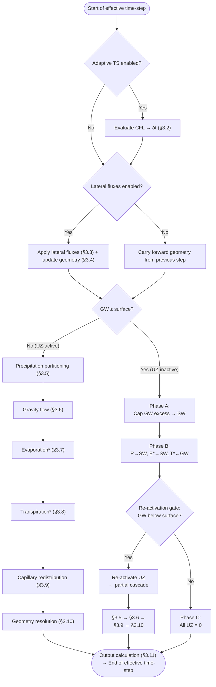

# GWSWEX Model Physics
This document describes the physical and numerical framework of the GWSWEX model, including the governing equations, discretisation, and solution procedures. Shared spatial primitives are in §2. The **explicit** operator-split solver is in §3 and the **implicit** full-column Richards solver is in §4.

## 1. Overview
GWSWEX is a vertically resolved hydrological model that couples surface water (SW), groundwater (GW), and unsaturated zone (UZ) dynamics at plot scale and above. The model offers two numerical solvers:

- **Explicit** (§3): an operator-split, forward-Euler cascade with CFL-adaptive sub-stepping. Each flux process (gravity flow, capillary redistribution, ET) is resolved sequentially as a separate module. Fast per step but CFL-limited.
- **Implicit** (§4): a full-column, backward-Euler Richards solver with Picard iteration and TDMA. All vertical fluxes are resolved simultaneously. Unconditionally stable with no sub-stepping, operator splitting, or geometry freeze.

Both solvers share the same spatial discretisation (§2) and the same Python API. The solver choice is a configuration option at model initialisation.

The model evolves storage states in layered soil columns under atmospheric forcing (precipitation, evaporation, transpiration) and optional lateral SW and GW fluxes prescribed as source/sink terms. It is spatially agnostic, i.e. each model element represents an independent soil column, and the model solves each element in isolation. Lateral interactions between elements are handled externally by the models to which GWSWEX is coupled.

The model tracks three storage variables, all expressed in depth units $[L]$:

- **UZ storage** $\text{UZ}^{[l]}$: the volume of water per unit area held in unsaturated layer $l$. This is the primary prognostic variable governed by the model physics.
- **GW elevation** $\text{GW}$: the elevation $[L]$ of the groundwater table within the soil column. GW serves as a lower boundary condition for the UZ, updated by net vertical fluxes through the column base and by any lateral fluxes prescribed by the GW model.
- **SW storage** $\text{SW}$: the depth $[L]$ of ponded water at the ground surface. SW serves as an upper boundary condition, updated by precipitation, infiltration, evaporation, and any lateral fluxes prescribed by the SW model.

The total storage volume, in UZ and SW buckets, for any element can be obtained by multiplying depth by cell area. For GW, however, the storage volume is not simply $\text{GW} - z_\text{bot}^{[n_l]} \cdot A$ because the drainable volume per unit area varies with depth due to vertical heterogeneity in specific yield. The conversion between GW elevation and drainable volume is described in [§2.2](#22-drainable-gw-volume).

### 1.1 Vertical discretisation
The soil column is discretised into $n_l$ layers between the ground surface $z_\text{top}^{[1]}$ (top of layer 1) and the domain bottom $z_\text{bot}^{[n_l]}$ (bottom of layer $n_l$, typically the top of the first confining unit). Layer $l$ has top elevation $z_\text{top}^{[l]}$ and bottom elevation $z_\text{bot}^{[l]}$. Layers are numbered from the surface downward: layer 1 is the uppermost and layer $n_l$ the deepest. Each layer is assigned a soil material that defines its hydraulic properties ($K_\text{sat}$, $\theta_s$, $\theta_r$, $\alpha$, $n$, and $S_y$), permitting vertical heterogeneity.

At any given time, the GW elevation partitions the column into saturated layers below and unsaturated layers above. The GW boundary layer $l_\text{GW}$ is the shallowest partially saturated layer. The active (unsaturated) thickness of each layer $d_a^{[l]}$ and its effective pore volume $\text{ePV}^{[l]}$ follow directly from this partition. Their formal definitions and the derivation of $l_\text{GW}$ are given in [§2.1](#21-vertical-discretisation).

### 1.2 Drainable GW volume
Because specific yield $S_y^{[l]} = \theta_s^{[l]} - \theta_r^{[l]}$ varies by layer, converting between a GW elevation and the corresponding drainable water volume requires integrating through the layers the GW table traverses. The drainable GW volume function $V_\text{GW}$ and its piecewise-linear inverse $V_\text{GW}^{-1}$ are used throughout the solver for all GW elevation updates; their formal definitions are given in [§2.2](#22-drainable-gw-volume).

### 1.3 Time-stepping
The simulation period is divided into macro-steps of prescribed duration $\Delta t$, at which results are reported. An optional CFL-based adaptive sub-stepping scheme ([§3.2](#32-adaptive-time-stepping)) may subdivide each macro-step into variable-length sub-steps $\delta t_i$ to maintain numerical stability. Throughout the solver description that follows ([§3](#3-explicit-solver)), the symbol $\Delta t$ denotes the effective step duration: the full macro-step when sub-stepping is disabled, or the sub-step duration $\delta t_i$ when it is enabled. Since all physics are expressed as rate $\times$ duration, this convention requires no structural modification to the flux formulae.

## 2. Shared spatial framework

### 2.1 Vertical discretisation
The GW boundary layer $l_\text{GW}$ is the shallowest layer whose bottom lies at or below the GW elevation:

$l_\text{GW} = \min\!\left(l \in 1 .. n_l : z_\text{bot}^{[l]} \leq \text{GW}_t\right)$

Layers above $l_\text{GW}$ are unsaturated; layers below are saturated; the boundary layer itself is partially unsaturated. The active (unsaturated) thickness of each layer is:

$d_a^{[l]} = \begin{cases} z_\text{top}^{[l]} - z_\text{bot}^{[l]}, & l < l_\text{GW} \\ z_\text{top}^{[l]} - \text{GW}_t, & l = l_\text{GW} \\ 0, & l > l_\text{GW} \end{cases}$

where $d_a^{[l]}$ denotes the depth of layer $l$ that can hold unsaturated water.

The effective pore volume of each layer is:

$\text{ePV}^{[l]} = d_a^{[l]} \cdot \theta_s^{[l]}$

where $\theta_s^{[l]}$ is the saturated volumetric water content (porosity) of the material assigned to layer $l$. Layers below $l_\text{GW}$ have $\text{ePV}^{[l]} = 0$.

### 2.2 Drainable GW volume
The drainable GW volume function $V_\text{GW}(h)$ gives the total drainable water (per unit area) stored below elevation $h$:

$$V_\text{GW}(h) = \sum_{l=1}^{n_l} S_y^{[l]} \cdot \max\!\big(0,\;\min(h,\, z_\text{top}^{[l]}) - z_\text{bot}^{[l]}\big) \;+\; S_y^{[1]} \cdot \max(0,\; h - z_\text{top}^{[1]})$$

A fully saturated layer ($h \geq z_\text{top}^{[l]}$) contributes $S_y^{[l]} \cdot (z_\text{top}^{[l]} - z_\text{bot}^{[l]})$; a partially saturated layer ($z_\text{bot}^{[l]} < h < z_\text{top}^{[l]}$) contributes $S_y^{[l]} \cdot (h - z_\text{bot}^{[l]})$; a dry layer ($h \leq z_\text{bot}^{[l]}$) contributes nothing. The second term extends the function above the surface using $S_y^{[1]}$, consistent with the GW-excess-to-SW cap ([§3.1](#31-control-flow), [§3.10.1](#3101-surface-boundary-check)). For a homogeneous column ($S_y$ uniform), the function simplifies to $S_y \cdot \max(0,\, h - z_\text{bot}^{[n_l]})$.

$V_\text{GW}$ is piecewise linear with slope $S_y^{[l]}$ within each layer, so its inverse $V_\text{GW}^{-1}$ is well defined and can be evaluated directly. Define the cumulative drainable volume at each layer top:

$V_l = V_\text{GW}(z_\text{top}^{[l]}) = \displaystyle\sum_{k=l}^{n_l} S_y^{[k]} \cdot (z_\text{top}^{[k]} - z_\text{bot}^{[k]}), \qquad l = 1 \ldots n_l$

and $V_{n_l+1} = 0$ (the volume at the domain bottom $h = z_\text{bot}^{[n_l]}$). Given a target drainable volume $V$, the inverse is:

$$V_\text{GW}^{-1}(V) = \begin{cases} -1, & V \leq 0 \quad \text{(error: non-physical volume)} \\[4pt] z_\text{bot}^{[l]} + \dfrac{V - V_{l+1}}{S_y^{[l]}}, & V_{l+1} < V \leq V_l, \quad l = n_l, \ldots, 1 \\[8pt] z_\text{top}^{[1]} + \dfrac{V - V_1}{S_y^{[1]}}, & V > V_1 \end{cases}$$

The middle case locates the layer $l$ whose breakpoint interval $(V_{l+1},\, V_l]$ contains $V$, then linearly interpolates within that layer. The sentinel $V_{n_l+1} = 0$ represents the drainable volume at the domain bottom ($h = z_\text{bot}^{[n_l]}$): the drainable fraction of the deepest layer has been entirely removed when $V = 0$. Since layers are contiguous ($z_\text{bot}^{[l]} = z_\text{top}^{[l+1]}$), $V_{l+1} = V_\text{GW}(z_\text{bot}^{[l]})$ is the drainable volume at the bottom of layer $l$.

Throughout the solver, the total drainable GW volume at any point is $V_\text{GW}(\text{GW}_t)$. When a volume $\Delta V$ is extracted from or added to GW, the updated GW elevation is:

$$\text{GW}_t = V_\text{GW}^{-1}\!\big(V_\text{GW}(\text{GW}_t) \pm \Delta V\big)$$

This conversion is used for all GW elevation updates, including those within the [geometry-freeze](#geometry-freeze) window (explicit solver), because a volume change large enough to push GW across a layer boundary must account for the differing specific yields of the layers traversed. A single-layer approximation ($\Delta h = \Delta V / S_y^{[l_\text{GW}]}$) would produce an incorrect GW elevation whenever the table crosses a material boundary, and this error is not self-correcting: the geometry resolution step ([§3.10](#310-geometry-resolution)) takes $\text{GW}_t$ as given and does not re-derive it from volume conservation.

## 3. Explicit solver

The explicit solver uses an operator-split, forward-Euler cascade with CFL-adaptive sub-stepping. The numerical strategy specific to this solver is described in the following preamble subsections; the step-by-step control flow begins at [§3.1](#31-control-flow).

#### Operator splitting
The solver steps ([§3.3](#33-lateral-fluxes-optional) to [§3.11](#311-output-calculation)) are solved in sequence rather than simultaneously. Each step updates $\text{GW}_t$, $\text{SW}_t$, and $\text{UZ}_t^{[l]}$ in place, and the updated values are immediately visible to subsequent steps. This is sequential-state operator splitting (Godunov splitting; Lie-Trotter product formula). The splitting error is first-order in $\Delta t$ and is directly controlled by adaptive sub-stepping when enabled.

The step order follows physical response timescales: gravity drainage ($\sim$ minutes to hours) precedes ET ($\sim$ hours), which precedes capillary redistribution ($\sim$ hours to days). Faster processes update storage first and supply their results to slower processes. Note that lateral fluxes are treated as a non-advective immediate source/sink term at the start of the step, before any vertical fluxes are calculated. This is a deliberate choice to allow for effective coupling with external SW and GW models that prescribe lateral fluxes based on the current state of the system.

#### Geometry freeze
The GW boundary layer index $l_\text{GW}$ and all geometry-derived quantities ($d_a$, $\text{ePV}$, $\text{UZ}_\text{eq}$) are held fixed from the start of precipitation partitioning ([§3.5](#35-precipitation-partitioning)) through to the end of capillary redistribution ([§3.9](#39-capillary-redistribution)). Only $\text{GW}_t$ accumulates in-place changes as the sequence proceeds. All geometry is recalculated at geometry resolution ([§3.10](#310-geometry-resolution)).

This avoids circular dependencies between flux modules and the evolving GW elevation, prevents moving-boundary artefacts (e.g. a layer switching abruptly from active to saturated mid-cascade), and ensures all capacity limits reference a single consistent geometry throughout the step. The mismatch between the frozen geometry and the evolving $\text{GW}_t$ is first-order in $\Delta t$ and is fully corrected at [§3.10](#310-geometry-resolution). 

> [!NOTE]
> **DEFERRED:** 
Per-module geometry updates would eliminate the geometry-freeze error entirely, at the cost of $O(n_l)$ retention-curve quadratures per module per step and the risk of moving-boundary oscillations if $l_\text{GW}$ changes mid-sequence. This trade-off is best evaluated empirically against HYDRUS-1D. See also the related open question for capillary redistribution ([§3.9](#39-capillary-redistribution)).

#### Frozen-coefficient approximation
The unsaturated hydraulic conductivity $K_\text{unsat}^{[l]}$ and the derived transfer capacity $\text{TC}^{[l]} = K_\text{unsat}^{[l]} \cdot \Delta t$ are computed at the start of gravity flow ([§3.6](#36-gravity-flow)) from the pre-inflow moisture state. However, two important departures from a strict frozen-coefficient scheme are implemented:

1. **Post-inflow K correction in gravity flow** ([§3.6.2](#362-unsaturated-hydraulic-conductivity)): When a layer receives nonzero inflow during active infiltration, K is re-evaluated from the post-inflow moisture state and the effective K is taken as the arithmetic mean of the pre-inflow and post-inflow values. This prevents the cascade from stalling for one sub-step at each dry layer (the frozen-coefficient artefact in which a previously dry layer evaluates K from near-residual moisture and passes almost nothing through, even though inflow has just wetted it).

2. **K re-evaluation in capillary redistribution** ([§3.9](#39-capillary-redistribution)): The capillary module performs a single upward pass and re-evaluates K from the donor layer's current (updated) moisture state at each layer step, rather than reusing the TC values from gravity flow. This means a layer that has just received capillary water and gained conductivity supplies the layer above it within the same pass.

Outside these two contexts, K and TC remain frozen within each sub-step. The resulting approximation error is first-order in $\Delta t$ and is localised to the sub-step duration when adaptive time-stepping is enabled.

#### Physical bounds enforcement
Each step in the sequence incorporates min/max limiters that maintain the following invariants:

| Invariant | Enforced at |
|---|---|
| $\text{GW}_t \geq z_\text{bot}^{[n_l]}$ | [§3.3](#33-lateral-fluxes-optional) (clamp after lateral flux), [§3.8](#38-transpiration-optional) (transpiration from GW $\leq$ available volume) |
| $\text{SW}_t \geq 0$ | [§3.3](#33-lateral-fluxes-optional) (clamp after lateral flux), [§3.5](#35-precipitation-partitioning) (infiltration $\leq$ available SW) |
| $\text{UZ}_t^{[l]} \leq \text{ePV}^{[l]}$ | [§3.5](#35-precipitation-partitioning) (infiltration $\leq$ top-layer pore space + GW deficit), [§3.10](#310-geometry-resolution) (excess $\to$ GW) |
| $\text{UZ}_t^{[l]} \geq \theta_r^{[l]} \cdot d_a^{[l]}$ | [§3.7](#37-evaporation-optional) and [§3.8](#38-transpiration-optional) (ET $\leq$ available water above residual), [§3.9](#39-capillary-redistribution) (capillary supply $\leq$ available water of donor) |
| $\text{GW}_t \leq z_\text{top}^{[1]}$ | [§3.10](#310-geometry-resolution) (excess $\to$ SW) |
| Capillary rise from GW $\leq$ available GW | [§3.9](#39-capillary-redistribution) (boundary-layer flux $\leq V_\text{GW}(\text{GW}_t)$) |

These bounds are structural, embedded in the flux formulae via $\min$/$\max$ operators. The only post-hoc correction is the over-saturation cap in [§3.10](#310-geometry-resolution), which serves as a safety net for residual numerical overshoot from sequential flux accumulation.

### 3.1 Control flow
The solver executes one of two branches at each effective time-step, depending on the saturation state of the column after pre-processing. The following flowchart provides an overview; the two branches are described in detail below. Modules marked with an asterisk (\*) are optional.

#### Pre-processing
Before the branch decision, two optional pre-processing steps are evaluated:

1. **Adaptive time-stepping** ([§3.2](#32-adaptive-time-stepping)): if enabled, the CFL condition is evaluated from the current moisture and geometry state to determine the sub-step duration $\delta t_i$.
2. **Lateral fluxes and geometry update** ([§3.3](#33-lateral-fluxes-optional), [§3.4](#34-geometry-update)): if lateral fluxes are enabled, they are applied to SW and GW, and the geometry is then updated to reflect the modified $\text{GW}_t$. If lateral fluxes are disabled, the geometry from the previous step's geometry resolution ([§3.10](#310-geometry-resolution)) is carried forward unchanged (see [§3.4](#34-geometry-update) for the condition under which this skip is valid).

#### UZ-active branch

When $\text{GW}_t < z_\text{top}^{[1]}$ after pre-processing, at least one unsaturated layer exists and the solver executes the following cascade in sequence:

| Step | Module | Section |
|------|--------|---------|
| 1 | Precipitation partitioning | [§3.5](#35-precipitation-partitioning) |
| 2 | Gravity flow | [§3.6](#36-gravity-flow) |
| 3 | Evaporation (optional) | [§3.7](#37-evaporation-optional) |
| 4 | Transpiration (optional) | [§3.8](#38-transpiration-optional) |
| 5 | Capillary redistribution | [§3.9](#39-capillary-redistribution) |
| 6 | Geometry resolution | [§3.10](#310-geometry-resolution) |
| 7 | Output calculation | [§3.11](#311-output-calculation) |

Each step operates on the storage state left by the preceding step (see [Operator splitting](#operator-splitting)). Geometry-derived quantities are frozen during steps 1 to 5 (see [Geometry freeze](#geometry-freeze)) and recomputed at step 6.

#### UZ-inactive branch
When $\text{GW}_t \geq z_\text{top}^{[1]}$ after pre-processing, the entire column is saturated: $l_\text{GW} = 0$, all $\text{ePV}^{[l]} = 0$, and the UZ-active sequence cannot execute. The solver follows a limited branch with a re-activation gate after the only operation within this branch that can lower GW (transpiration from the saturated zone), so that the UZ-active sequence resumes the moment unsaturated layers re-emerge. Lateral fluxes, the other process capable of modifying GW, are already applied in pre-processing ([§3.3](#33-lateral-fluxes-optional)) before the saturation check; if lateral withdrawal lowers GW below the surface, the saturation check directs the solver to the UZ-active branch directly.

**Phase A: cap excess GW.**
Any GW volume above the surface is transferred to SW and GW is capped:

$\text{SW}_t = \text{SW}_t + (\text{GW}_t - z_\text{top}^{[1]}) \cdot S_y^{[1]}$

$\text{GW}_t = z_\text{top}^{[1]}$

where $S_y^{[l]} = \theta_s^{[l]} - \theta_r^{[l]}$ is the specific yield of layer $l$ ([§2.2](#22-drainable-gw-volume)). The above-surface excess is converted at $S_y^{[1]}$ because no distinct material exists above the ground surface; by the definition of $V_\text{GW}$, the drainable volume above $z_\text{top}^{[1]}$ is $S_y^{[1]} \cdot (\text{GW}_t - z_\text{top}^{[1]})$. Lateral fluxes have already been applied in pre-processing ([§3.3](#33-lateral-fluxes-optional)); any lateral GW inflow that pushed GW above $z_\text{top}^{[1]}$ is captured here and routed to SW via the cap.

**Phase B: reduced surface operations.**
(B1) All precipitation is added to SW:
$\text{SW}_t = \text{SW}_t + P_\text{rate} \cdot \Delta t$.

(B2) If evaporation is enabled, it is extracted from SW without stress limitation:
$E_\text{act} = \min(E_\text{pot},\; \text{SW}_t)$
$\text{SW}_t = \text{SW}_t - E_\text{act}$

When the column is fully saturated the SW store is the only evaporation source. Any remaining demand beyond what SW can supply is not extracted from GW; GW is a subsurface store that does not directly exchange water vapour with the atmosphere.

(B3) If transpiration is enabled, it is extracted from GW (roots are submerged):
$T_\text{GW} = \min(T_\text{pot},\; V_\text{GW}(\text{GW}_t),\; K_\text{sat}^{[1]} \cdot \Delta t)$
$\text{GW}_t = V_\text{GW}^{-1}(V_\text{GW}(\text{GW}_t) - T_\text{GW})$

(B4) **Re-activation gate**: if $\text{GW}_t < z_\text{top}^{[1]}$ after Phase B, the column is no longer fully saturated and UZ dynamics must resume. Before entering the partial cascade, Phase B operations are reversed to avoid double-counting:

$\text{SW}_t = \text{SW}_t - P_\text{rate} \cdot \Delta t$

$\text{acc\_precip} = \text{acc\_precip} - P_\text{rate} \cdot \Delta t$

This reversal is necessary because Phase B1 added all precipitation directly to SW, but the partial cascade begins with precipitation partitioning ([§3.5](#35-precipitation-partitioning)), which will re-apply precipitation through the Green-Ampt infiltration logic. Without the reversal, one macro-step's precipitation would be applied twice.

After the reversal, apply the re-activation procedure (below) and execute a partial sequence: precipitation partitioning ([§3.5](#35-precipitation-partitioning)), gravity flow ([§3.6](#36-gravity-flow)), capillary redistribution ([§3.9](#39-capillary-redistribution)), and geometry resolution ([§3.10](#310-geometry-resolution)). Evaporation and transpiration are skipped because demand has already been resolved in Phase B.

**Phase C: termination** (entered only if GW remains $\geq z_\text{top}^{[1]}$ after the re-activation gate). All $\text{UZ}^{[l]} = 0$. Proceed to output calculation ([§3.11](#311-output-calculation)).

#### Re-activation procedure
Referenced by the re-activation gate. Recalculate $l_\text{GW}$, $d_a$, $\text{ePV}$, and $\text{UZ}_\text{eq}$ via [§3.4](#34-geometry-update). Initialise all newly exposed layers at residual moisture:

$$\text{UZ}_t^{[l]} = \theta_r^{[l]} \cdot d_a^{[l]}$$

This is the only mass-conservative initialisation: the drainable fraction ($S_y^{[l]} \cdot d_a^{[l]}$) was already removed from GW by the process that caused the drop, and only the irreducible residual moisture remains in-place. The subsequent cascade steps redistribute moisture physically: infiltration from ponded SW combined with any incident precipitation enters via the top, gravity flow moves it downward, and capillary redistribution pulls water upward from the GW to relax depleted layers toward their equilibrium profiles.

### 3.2 Adaptive time-stepping
When adaptive time-stepping is enabled, the macro-step $\Delta t$ is divided into a sequence of variable-length sub-steps. Before each sub-step, the CFL condition is evaluated from the current moisture and geometry state to determine the largest safe sub-step duration $\delta t_\text{safe}$. The actual sub-step $\delta t_i$ is clamped to the remaining interval so that sub-steps sum exactly to $\Delta t$. The full solver sequence ([§3.3](#33-lateral-fluxes-optional) to [§3.11](#311-output-calculation)) is executed for each sub-step. Results are reported at the macro-step frequency. When the entire macro-step satisfies the CFL under a single sub-step, no overhead is incurred.

#### 3.2.1 Physical basis of the CFL constraint
The Courant-Friedrichs-Lewy (CFL) condition (Courant et al. 1928) is a necessary stability criterion for explicit (forward-Euler) finite-difference schemes: the numerical domain of dependence must encompass the physical domain of dependence. In the context of unsaturated flow, this means that the volume drained from any layer in a single time step must not exceed the pore capacity of that layer; equivalently, information about the drainage state of layer $l$ must not propagate past the layer boundary within one step. Exceeding this limit causes the storage of layer $l$ to overshoot (go negative or exceed $\text{ePV}^{[l]}$), which is a well-known artefact of forward-Euler advection schemes (LeVeque 1992).

The dominant inter-layer flux is gravity drainage, governed by $K_\text{unsat}^{[l]}$. The explicit forward-Euler treatment of this flux, in which each layer's drainage rate is computed from moisture at the start of the step and applied without iteration, is numerically stable only when the volume drained from any layer does not exceed a Courant-number fraction of that layer's pore capacity. The CFL constraint on sub-step duration is:

$$K_\text{unsat}^{[l]} \cdot \delta t \;\leq\; C_r \cdot \text{ePV}^{[l]}, \qquad l = 1 \ldots l_\text{GW}$$

> [!NOTE]
> **DEFERRED:** The Green-Ampt capacity $f_\text{cap}$ (not $K_\text{unsat}^{[1]}$) controls the flux into the first layer; a dry first layer with $K_\text{unsat}^{[1]} \approx 0$ does not produce $\delta t_\text{CFL}^{[1]} \to \infty$ when a Green-Ampt CFL constraint based on $f_\text{cap}$ is used. Using $\delta t_P^{[1]}$ based on $f_\text{cap} \cdot \Delta t$ instead of the precipitation rate as the CFL denominator may replace the current precipitation constraint and remove the need for the latter's $\epsilon$ floor. This will be evaluated in the diagnostics phase.

where $C_r \in (0, 1]$ is the Courant number (default: 0.9). Rearranging yields the safe sub-step from layer $l$:

$\delta t_\text{CFL}^{[l]} = C_r \cdot \dfrac{\text{ePV}^{[l]}}{K_\text{unsat}^{[l]}}, \qquad l = 1 \ldots l_\text{GW}$

$K_\text{unsat}^{[l]}$ is evaluated from the current moisture state entering each sub-step using the Mualem-van Genuchten relation ([§3.6.2](#362-unsaturated-hydraulic-conductivity)). A dry layer gives $K_\text{unsat}^{[l]} \approx 0$ and $\delta t_\text{CFL}^{[l]} \to \infty$ (non-constraining); a near-saturated layer gives the smallest $\delta t_\text{CFL}^{[l]}$ and drives sub-stepping.

The exfiltration from each layer ([§3.6.5](#365-exfiltration-flux)) is further modulated by $\text{ICratio}^{[l]} \leq 1$, which reduces the actual flux below the bare $K_\text{unsat}$ value used in the CFL. The CFL therefore over-estimates the true flux and may generate unnecessary sub-steps during low-connectivity phases. This conservative treatment is deliberate: it avoids coupling the CFL to the IC state and guarantees stability at $\text{ICratio} = 1$.

Substituting $K_\text{sat}^{[l]}$ for $K_\text{unsat}^{[l]}$ is always safe ($K_\text{unsat} \leq K_\text{sat}$) and may serve as a fallback before moisture states are available, at the cost of over-constraining $\delta t$ during dry conditions.

#### 3.2.2 Additional flux constraints
Two further pathways can drive numerical overshoot independently of gravity drainage.

**Surface infiltration rate.** During intense precipitation, the incoming flux can cause a large fractional storage change in a near-saturated top layer, degrading the frozen-coefficient approximation:

$\delta t_P^{[1]} = C_r \cdot \dfrac{\max(\text{ePV}^{[1]} - \text{UZ}_t^{[1]},\; \epsilon)}{\max(P_\text{rate},\; \epsilon)}, \qquad \text{applied only when } P_\text{rate} > 0$

where $\epsilon$ is a small floor to avoid division by near-zero, $P_\text{rate}$ $[L\,T^{-1}]$ is the precipitation rate, and $\text{UZ}_t^{[1]}$ is the top-layer UZ storage entering the sub-step. The infiltration formula ([§3.5](#35-precipitation-partitioning)) already caps infiltration at available pore space, so this constraint serves accuracy rather than state-violation prevention. Note that when ponded SW exists, infiltration is governed by the Green-Ampt capacity $f_\text{cap}$ rather than $P_\text{rate}$; in that case, $\delta t_P^{[1]}$ as formulated above under-constrains the step (see the Green-Ampt note in [§3.2.1](#321-physical-basis-of-the-cfl-constraint)).

**Lateral GW withdrawal.** A large negative lateral GW flux can drive GW to the domain bottom in a single step:
$\delta t_\text{lat} = C_r \cdot \dfrac{\max(\text{GW}_t - z_\text{bot}^{[n_l]},\; \epsilon)}{\max(|\text{GW}_\text{lateral}|,\; \epsilon)}, \qquad \text{applied only when } \text{GW}_\text{lateral} < 0$

This is less critical than the $K_\text{unsat}$ constraint (GW is already clamped at $z_\text{bot}^{[n_l]}$) but eliminates repeated clamping events when lateral extraction is large.

> [!NOTE]
> **DEFERRED:** A CFL constraint on lateral SW fluxes analogous to the lateral GW constraint may be appropriate when SW lateral velocities are large. It was omitted here because SW lateral fluxes are prescriptions from an external model and GWSWEX treats them as instantaneous source/sink terms. If very large lateral SW inflows are observed to cause numerical issues, a constraint $\delta t_\text{SW,lat} = C_r \cdot \text{SW}_t / \max(|\text{SW}_\text{lateral}|, \epsilon)$ can be added.

**Capillary rise from GW** is not explicitly constrained by the CFL. The capillary flux to the boundary layer ([§3.9](#39-capillary-redistribution)) is capped by the capillary deficit and available GW volume, but no explicit CFL limit is placed on the total GW drawdown due to capillary extraction. During dry phases when capillary redistribution is active, $K_\text{unsat}$ is low throughout the column and sub-steps are consequently long; large single-step GW drops from capillary rise are therefore possible in principle. Should diagnostics show capillary-driven GW drops crossing multiple layer boundaries in a single sub-step — with attendant geometry-resolution artefacts — the constraint $\delta t_\text{cap} = C_r \cdot V_\text{GW}(\text{GW}_t) \;/\; \max(\text{cap\_deficit}^{[l_\text{GW}]},\; \epsilon)$ can be added without structural changes to the solver.

#### 3.2.3 Sub-step duration and loop
At the start of each sub-step $i$, the global safe duration is the minimum across all applicable constraints:

$\delta t_\text{CFL}^{(i)} = \min\!\left(\;\underset{l\,:\,K_\text{unsat}^{[l]} > 0}{\min}\; \delta t_\text{CFL}^{[l]},\;\; \delta t_P^{[1]},\;\; \delta t_\text{lat}\right)$

This is clamped to the admissible lower bound $\delta t_\text{min}$ and to the remaining macro-step interval $t_\text{rem}$:

$\delta t_\text{safe}^{(i)} = \max(\delta t_\text{min},\; \delta t_\text{CFL}^{(i)})$

$\delta t_i = \min(\delta t_\text{safe}^{(i)},\; t_\text{rem}), \qquad t_\text{rem} \leftarrow t_\text{rem} - \delta t_i$

The loop terminates when $t_\text{rem} = 0$, guaranteeing:

$$\sum_i \delta t_i = \Delta t$$

Re-evaluating the CFL at each sub-step is preferable to pre-computing a fixed number of equal sub-steps: once drainage has reduced moisture, $K_\text{unsat}$ decreases and the CFL permits longer sub-steps. Adaptive re-evaluation at each sub-step exploits this automatically, reducing unnecessary sub-stepping during drying phases.

#### 3.2.4 Forcing proration
All external forcings are expressed as rates $[L\,T^{-1}]$. Each is multiplied by $\delta t_i$ within the sub-step. Because $\sum_i \delta t_i = \Delta t$ exactly, the total volume delivered over the macro-step is preserved without explicit proration.

Any flux module must be sub-step compatible: it must operate on rates $[L\,T^{-1}]$ and multiply by $\delta t_i$ within the sub-step loop. A module that applies a macro-step-level volume directly (rather than a rate) violates the $\sum_i \delta t_i = \Delta t$ conservation guarantee.

#### 3.2.5 State continuity across sub-steps
- **IC and ICratio** evolve at each sub-step using $\delta t_i$, correctly representing wetting-front advance and dry-phase relaxation at sub-step resolution.
- **$K_\text{unsat}$ frozen-coefficient**: within each sub-step, $K_\text{unsat}^{[l]}$ and $\text{TC}^{[l]}$ are computed at the start of [§3.6](#36-gravity-flow) from the moisture state entering that sub-step, subject to the post-inflow K correction ([§3.6.2](#362-unsaturated-hydraulic-conductivity)). The approximation error is localised to $\delta t_i$ rather than $\Delta t$.
- **Geometry freeze**: $l_\text{GW}$, $d_a$, $\text{ePV}$, and $\text{UZ}_\text{eq}$ are frozen within each sub-step ([§3.5](#35-precipitation-partitioning) to [§3.9](#39-capillary-redistribution)) and recalculated at [§3.10](#310-geometry-resolution). The geometry-freeze error is proportional to $\delta t_i$.
- **Output accumulators** ($\Delta\text{GW}$, $\Delta\text{SW}$, $\Delta\text{UZ}$, cumulative precipitation, $E_\text{act}$, $T_\text{act}$, lateral fluxes) are summed across sub-steps and reported once per macro-step.

### 3.3 Lateral fluxes (optional)
When enabled, lateral fluxes for SW and GW are applied as source/sink terms at the beginning of each step, before any vertical flux calculations. These represent lateral movement prescribed by external SW and GW models and provide the coupling mechanism for iterative convergence between GWSWEX and those models. While that is the primary purpose, they may also be used to prescribe other source/sink terms acting on SW or GW (e.g. irrigation, externally computed ET withdrawals).

$\text{SW}_t = \text{SW}_{t-1} + \text{SW}_\text{lateral} \cdot \Delta t$

$\text{GW}_t = \max(z_\text{bot}^{[n_l]},\; \text{GW}_{t-1} + \text{GW}_\text{lateral} \cdot \Delta t)$

where $\text{SW}_\text{lateral}$ and $\text{GW}_\text{lateral}$ $[L\,T^{-1}]$ are the net lateral flux rates to (+ve) or from (-ve) SW and GW respectively, and $z_\text{bot}^{[n_l]}$ is the domain bottom elevation.

The formulation above is used as written by the explicit solver. The implicit solver applies lateral SW the same way (a pre-step source/sink on $\text{SW}_{t-1}$) but cannot apply lateral GW as a pre-step displacement of $\text{GW}_t$, because the implicit GW elevation is re-derived from the converged Picard head profile at the end of the step ([§4.9](#49-water-table-determination)) and would discard any pre-step shift. Instead, $\text{GW}_\text{lateral}$ is injected as a distributed source term inside the Richards equation (see [§4.7.3](#473-lateral-gw-source-term-implicit-only)), so that the converged head profile mechanically reflects the lateral inflow / outflow.

When this module is disabled, $\text{SW}_t = \text{SW}_{t-1}$ and $\text{GW}_t = \text{GW}_{t-1}$ at the start of each step (i.e. no lateral source/sink is applied).

### 3.4 Geometry update
After lateral fluxes are applied (or at the start of the step if lateral fluxes are disabled), the GW boundary layer, active thicknesses, effective pore volumes, and equilibrium storages are recalculated from the current $\text{GW}_t$.

**Conditional skip:** The geometry depends solely on $\text{GW}_t$ and the fixed layer boundaries. When $\text{GW}_t$ is unchanged from the state at which geometry was last computed ([§3.10](#310-geometry-resolution) of the previous step, or the initial condition), the recomputation is redundant and may be omitted. This condition holds when lateral fluxes are disabled and the previous step's geometry resolution did not modify $\text{GW}_t$ during layer state transitions or boundary corrections ([§3.10.2](#3102-layer-state-transitions) to [§3.10.1](#3101-surface-boundary-check)). The skip saves $O(n_l)$ retention-curve quadratures per element per step and is exact (not an approximation). When lateral fluxes are enabled, GW has changed and the geometry update must execute.

#### 3.4.1 Active layer geometry
The GW boundary layer, active thickness, and effective pore volume are computed as defined in [§2.1](#21-vertical-discretisation).

#### 3.4.2 Equilibrium storage

The equilibrium storage $\text{UZ}_\text{eq}^{[l]}$ represents the capillary-supported water content of layer $l$ at hydrostatic equilibrium with the current GW elevation. It is computed as the integral of the van Genuchten retention curve over the active depth of the layer.

The matric potentials at the top and bottom of each active layer, measured as height above the GW elevation (negative by convention, since the GW surface is the zero-potential datum), are:

$\psi_{m,\text{top}}^{[l]} = \text{GW}_t - z_\text{top}^{[l]}, \qquad l = 1 \ldots l_\text{GW}$

$\psi_{m,\text{bot}}^{[l]} = \begin{cases} \text{GW}_t - z_\text{bot}^{[l]}, & l < l_\text{GW} \\ 0, & l = l_\text{GW} \end{cases}$

Note that $\psi_m \leq 0$ throughout the unsaturated zone (matric potential is negative above the GW surface, which serves as the zero-potential datum), with $\psi_m = 0$ at the GW surface.

The van Genuchten retention curve gives the volumetric water content at matric potential $h$:

$\theta_c^{[l]}(\psi_m) = \theta_r^{[l]} + \dfrac{\theta_s^{[l]} - \theta_r^{[l]}}{\left[1 + (\alpha^{[l]} |\psi_m|)^{n^{[l]}}\right]^{m^{[l]}}}$

where $\alpha^{[l]}$ $[L^{-1}]$ and $n^{[l]}$ $[-]$ are the van Genuchten shape parameters, $m^{[l]} = 1 - 1/n^{[l]}$, and $\theta_r^{[l]}$ and $\theta_s^{[l]}$ are the residual and saturated volumetric water contents respectively.

The equilibrium storage is then:

$\text{UZ}_\text{eq}^{[l]} = \begin{cases} \displaystyle\int_{\psi_{m,\text{bot}}^{[l]}}^{\psi_{m,\text{top}}^{[l]}} \theta_c^{[l]}(\psi_m)\,d\psi_m, & l \leq l_\text{GW} \\[6pt] 0, & l > l_\text{GW} \end{cases}$

Layers closer to the GW elevation hold more capillary water at equilibrium; layers far above GW approach $\theta_r$.

### 3.5 Precipitation partitioning
Existing surface water (after lateral fluxes) and incident precipitation are combined as the total water available at the surface. Infiltration into the top layer is computed with a Green-Ampt-style capacity, then limited by available surface water and available pore space. Surface storage is updated by mass balance.

$P = P_\text{rate} \cdot \Delta t$

where $P_\text{rate}$ $[L\,T^{-1}]$ is the precipitation rate and $P$ $[L]$ is the precipitation volume for the step.

$\text{SW}_\text{avail} = \text{SW}_t + P$

#### 3.5.1 Green-Ampt infiltration capacity
The infiltration capacity is computed from the saturation deficit of the top layer and the cumulative infiltration depth $F$:

$\Delta\theta = \theta_s^{[1]} - \theta_{t-1}^{[1]}$

$f_\text{cap} = K_\text{sat}^{[1]} \left(1 + \dfrac{\psi_f \, \Delta\theta}{F}\right)$

where $\theta_{t-1}^{[1]}$ is the volumetric water content of the top layer at the previous step, $\psi_f$ $[L]$ is a suction-head fitting parameter (approximately $1/\alpha$ from van Genuchten), and $F$ $[L]$ is the cumulative infiltration depth, which tracks the depth of the wetting front and is updated after gravity flow is resolved ([§3.6.7](#367-cumulative-infiltration-update)).

#### 3.5.2 Actual infiltration and surface storage update
$\text{infiltration} = \min\!\big(f_\text{cap} \cdot \Delta t,\; \text{SW}_\text{avail},\; \text{ePV}^{[1]} - \text{UZ}_{t-1}^{[1]} \,+\, S_y^{[1]} \cdot (z_\text{top}^{[1]} - \text{GW}_t)\big)$

$\text{SW}_t = \text{SW}_\text{avail} - \text{infiltration}$

The third bound is the **column sink capacity**: the unsaturated pore space in the top layer ($\text{ePV}^{[1]} - \text{UZ}_{t-1}^{[1]}$) plus the column-wide GW saturation deficit ($S_y^{[1]} \cdot (z_\text{top}^{[1]} - \text{GW}_t)$, the drainable volume that can be added before the WT reaches the surface; for a vertically heterogeneous column this generalises to $V_\text{GW}(z_\text{top}^{[1]}) - V_\text{GW}(\text{GW}_t)$). Including the GW deficit allows ponded SW to infiltrate even when the top-layer pore space has been filled by the capillary fringe (typical when $l_\text{GW} = 1$ and $\text{UZ}_t^{[1]} \approx \text{ePV}^{[1]}$); the surplus that exceeds the top-layer pore space is routed to GW by gravity flow ([§3.6](#36-gravity-flow)) and the over-saturation cap in geometry resolution ([§3.10.4](#3104-over-saturation-cap)). Without this term, ponded water on a near-saturated profile would remain stalled at the surface even when the WT lies below ground.

The infiltrated volume is delivered to the top layer via the gravity flow module ([§3.6](#36-gravity-flow)).

### 3.6 Gravity flow

Gravity-driven vertical flow is solved explicitly and sequentially from the top layer downward. For each layer, conductivity-limited drainage is computed from current storage, hydraulic conductivity, inter-layer connectivity state, and equilibrium storage target.

#### 3.6.1 Inflow definition
For any active layer $l$:

$\text{inflow}^{[l]} = \begin{cases} \text{infiltration}, & l = 1 \\ \text{exfiltration}^{[l-1]}, & l > 1 \end{cases}, \qquad l = 1 \ldots l_\text{GW}$

#### 3.6.2 Unsaturated hydraulic conductivity
$K_\text{unsat}^{[l]}$ is initially evaluated at the pre-inflow moisture state. The effective saturation is:

$S_e^{[l]} = \dfrac{\text{UZ}_{t-1}^{[l]} / d_a^{[l]} - \theta_r^{[l]}}{\theta_s^{[l]} - \theta_r^{[l]}}$

where $S_e^{[l]}$ $[-]$ is the effective saturation of layer $l$, naturally in $[0, 1]$ for valid moisture states. The Mualem-van Genuchten conductivity relationship gives:

$K_\text{unsat}^{[l]} = K_\text{sat}^{[l]} \cdot (S_e^{[l]})^\lambda \cdot \left[1 - \left(1 - (S_e^{[l]})^{1/m^{[l]}}\right)^{m^{[l]}}\right]^2$

where $\lambda$ $[-]$ is the pore-connectivity parameter (commonly 0.5 for mineral soils).

**Post-inflow K correction.** After inflow is added to the layer ([§3.6.3](#363-intermediate-uz-storage-update)), a conditional correction is applied: if both the inflow to the current layer and the infiltration at the surface are nonzero, K is re-evaluated from the post-inflow moisture state and the effective conductivity is taken as the arithmetic mean of the pre- and post-inflow values:

$$K_\text{eff}^{[l]} = \begin{cases} \frac{1}{2}(K_\text{pre}^{[l]} + K_\text{post}^{[l]}), & \text{inflow}^{[l]} > \epsilon \;\text{and}\; \text{infiltration} > \epsilon \\ K_\text{pre}^{[l]}, & \text{otherwise} \end{cases}$$

where $K_\text{pre}^{[l]}$ is the conductivity from the pre-inflow state and $K_\text{post}^{[l]}$ is the conductivity from the post-inflow state. This correction prevents the cascade from stalling at previously dry layers where the frozen pre-inflow K would be near zero, even though inflow has just raised the moisture content substantially. The averaging ensures that the wetting front response is immediate while remaining conservative (not fully using the post-inflow K). The condition gates the correction on active infiltration to preserve strict frozen-coefficient behaviour during non-infiltration phases (UZ-inactive re-activation, dry redistribution).

The transfer capacity, i.e. the maximum volume per unit area that conductivity permits to drain from layer $l$ during the step, is:

$\text{TC}^{[l]} = K_\text{eff}^{[l]} \cdot \Delta t$

This interpretation holds exactly when drainage from layer $l$ is not additionally limited by the receiving capacity of layer $l+1$ or by the inter-layer connectivity ratio $\text{ICratio}^{[l]}$. In practice, $\text{TC}^{[l]}$ provides an upper bound; the actual exfiltration from layer $l$ is further reduced by both factors ([§3.6.5](#365-exfiltration-flux)).

The capillary redistribution module ([§3.9](#39-capillary-redistribution)) re-evaluates K from the donor layer's current (updated) moisture state at each step of the single upward pass rather than reusing these TC values (see [Frozen-coefficient approximation](#frozen-coefficient-approximation)).

#### 3.6.3 Intermediate UZ storage update
$\text{UZ}_t^{[l]} = \text{UZ}_{t-1}^{[l]} + \text{inflow}^{[l]}, \qquad l = 1 \ldots l_\text{GW}$

#### 3.6.4 Inter-layer connectivity
The interconnectivity ratio $\text{ICratio}^{[l]}$ is a dynamic, bounded factor that modulates effective conductivity between layers based on the recent wetting/drying history. It is derived from the infiltration-front tracker $\text{IC}^{[l]}$, a state variable maintained across steps that serves as a proxy for wetting-front depth within the layer.

$\text{IC}^{[l]} = \begin{cases} \min(\text{IC}^{[l]} + \text{TC}^{[l]},\; d_a^{[l]}), & \text{inflow}^{[l]} > 0 \\ \max(\text{IC}^{[l]} - \text{TC}^{[l]},\; 0), & \text{otherwise} \end{cases}$

Note that TC here uses $K_\text{eff}^{[l]}$ from [§3.6.2](#362-unsaturated-hydraulic-conductivity), which includes the post-inflow K correction when infiltration is active. The IC tracker therefore responds immediately to wetting-front arrival, advancing faster when inflow is present than a purely frozen-coefficient IC would.

$\text{ICratio}^{[l]} = \max\!\left(\dfrac{\text{IC}^{[l]}}{d_a^{[l]}},\; \text{ICratio}_\text{min}^{[l]}\right)$

where $\text{ICratio}_\text{min}^{[l]}$ $[-]$ is a user-defined floor that represents structural connectivity (e.g. macropore or preferential flow paths) that persists even in the absence of recent wetting.

The IC advances/retreats by one transfer capacity per step during inflow/no-inflow conditions, bounded by the active layer thickness above and zero below. The ratio $\text{IC}^{[l]} / d_a^{[l]}$ thus represents the fraction of the layer depth that has been reached by the wetting front, governing the proportion of the layer's conductivity that is hydraulically connected for through-drainage.

#### 3.6.5 Exfiltration flux
The free (drainable) storage above capillary equilibrium is:

$\text{UZ}_\text{free}^{[l]} = \text{UZ}_t^{[l]} - \text{UZ}_\text{eq}^{[l]}$

Only water above equilibrium can drain; storage at or below equilibrium is held by capillary forces. The exfiltration from layer $l$ is:

$\text{exfiltration}^{[l]} = \min(\text{TC}^{[l]},\; \max(\text{UZ}_\text{free}^{[l]},\; 0)) \cdot \text{ICratio}^{[l]}, \qquad l = 1 \ldots l_\text{GW}$

Layer storage is then updated:

$\text{UZ}_t^{[l]} = \text{UZ}_t^{[l]} - \text{exfiltration}^{[l]}, \qquad l = 1 \ldots l_\text{GW} - 1$

#### 3.6.6 GW boundary layer
The exfiltration from the boundary layer recharges GW:

$\text{GW}_t = V_\text{GW}^{-1}\!\big(V_\text{GW}(\text{GW}_t) + \text{exfiltration}^{[l_\text{GW}]}\big)$

#### 3.6.7 Cumulative infiltration update
The Green-Ampt cumulative infiltration depth $F$ is updated for use in the next step:

$F = \begin{cases} \min(F,\; F_\text{min}) + \text{infiltration}, & \text{if } \text{SW}_\text{avail} > 0 \\ \min(F,\; F_\text{min}) - \text{exfiltration}^{[1]}, & \text{otherwise} \end{cases}$

where $F_\text{min}$ $[L]$ is a user-defined minimum that prevents division by zero in the Green-Ampt formula and represents the initial wetting-front depth.

### 3.7 Evaporation (optional)
*Operates on the post-gravity-flow state. Geometry is unchanged from [§3.4](#34-geometry-update).*

When enabled, potential soil evaporation demand is applied first to surface storage (without limitation) and then to the top UZ layer (with stress limitation).

#### 3.7.1 Potential evaporation demand
$E_\text{pot} = E_\text{rate} \cdot \Delta t$

where $E_\text{rate}$ $[L\,T^{-1}]$ is the potential evaporation rate.

#### 3.7.2 Extraction from surface storage
$E_\text{SW} = \min(E_\text{pot},\; \text{SW}_t)$

$\text{SW}_t = \text{SW}_t - E_\text{SW}$

$E_\text{residual} = E_\text{pot} - E_\text{SW}$

#### 3.7.3 Stress-limited extraction from UZ
If $E_\text{residual} > 0$, the remaining demand is applied to the top UZ layer with limitation from the Laio et al. (2001) stress function. The normalised saturation of the top layer is:

$s^{[1]} = \text{UZ}_t^{[1]} / \text{ePV}^{[1]}$

where $s^{[l]} = \text{UZ}_t^{[l]} / \text{ePV}^{[l]}$ denotes the saturation ratio (volumetric water content normalised by porosity) of layer $l$, naturally in $[0, 1]$ for valid moisture states. The saturation profile $s^{[l]}$ is stored alongside $\text{UZ}^{[l]}$ and $\text{ePV}^{[l]}$ in the output arrays at each macro-step, as it is the primary diagnostic variable for evaluating moisture-state physics. The stress-limited evaporation is:

$$E_\text{lim} = \begin{cases} 0, & s^{[1]} \leq s_h \\ E_\text{residual} \cdot \dfrac{s^{[1]} - s_h}{s_e - s_h}, & s_h < s^{[1]} \leq s_e \\ E_\text{residual}, & s^{[1]} > s_e \end{cases}$$

where $s_h$ $[-]$ is the hygroscopic point (saturation below which water is bound too tightly to the soil matrix for evaporation) and $s_e$ $[-]$ is the capillary-continuity threshold (saturation below which liquid pathways to the surface are disrupted). Both can be derived from soil hydraulic parameters rather than prescribed directly:

$$s_h \approx \frac{\theta_r^{[1]}}{\theta_s^{[1]}}$$

$$s_e \approx \frac{\text{UZ}_\text{eq}^{[1]}}{\text{ePV}^{[1]}}$$

The first expression identifies $s_h$ with the residual saturation, below which soil water is hygroscopically bound and unavailable for evaporation (Laio et al. 2001). The second identifies $s_e$ with the hydrostatic equilibrium saturation of the top layer: below this point, the capillary network is depleted and evaporation is supply-limited. User override is retained for cases where the retention curve does not adequately represent these thresholds (e.g. heavily aggregated soils).

Alternatively, if actual evaporation is directly prescribed as a forcing, the stress function is bypassed: $E_\text{lim} = E_\text{residual}$.

#### 3.7.4 Actual evaporation and storage update
The extractable water above residual content in the top layer is:

$\text{UZ}_\text{avail}^{[1]} = \text{UZ}_t^{[1]} - \theta_r^{[1]} \cdot d_a^{[1]}$

$E_\text{UZ} = \min(E_\text{lim},\; \text{UZ}_\text{avail}^{[1]})$

$E_\text{act} = E_\text{SW} + E_\text{UZ}$

$\text{UZ}_t^{[1]} = \text{UZ}_t^{[1]} - E_\text{UZ}$

### 3.8 Transpiration (optional)
*Operates on the post-evaporation state (or post-gravity-flow state if evaporation is disabled). Geometry is unchanged from [§3.4](#34-geometry-update).*

When enabled, potential transpiration demand is partitioned across rooted layers and extracted with stress limitation. Roots that intersect the saturated zone may access GW storage directly.

#### 3.8.1 Rooting mask
The vegetation type assigned to an element specifies a single rooting depth $d_\text{root}$ $[L]$ measured below the surface; for time-varying vegetation, $d_\text{root}(t)$ is interpolated linearly between user-supplied initial and final values across the run. A binary per-layer mask flags every layer whose midpoint falls within the current rooting depth:

$\text{root\_mask}^{[l]}(t) = \begin{cases} 1, & 0 \leq z_\text{surface} - z_\text{mid}^{[l]} \leq d_\text{root}(t) \\ 0, & \text{otherwise} \end{cases}$

$n_\text{root}(t) = \sum_{l=1}^{n_l} \text{root\_mask}^{[l]}(t)$

Transpiration demand is partitioned uniformly across the currently rooted layers, so no per-layer root-density profile is carried by the model:

$w_\text{root}^{[l]}(t) = \begin{cases} 1 / n_\text{root}(t), & \text{root\_mask}^{[l]}(t) = 1 \\ 0, & \text{otherwise} \end{cases}$

If $n_\text{root}(t) = 0$ for an element, transpiration is skipped for that element at that step.

#### 3.8.2 Potential transpiration demand
$T_\text{pot} = T_\text{rate} \cdot \Delta t$

where $T_\text{rate}$ $[L\,T^{-1}]$ is the potential transpiration rate. The demand per rooted unsaturated layer is:

$T_\text{pot}^{[l]} = T_\text{pot} \cdot \text{root\_mask}^{[l]} / n_\text{root}, \qquad l = 1 \ldots l_\text{GW}$

#### 3.8.3 Stress-limited extraction from UZ
The normalised saturation is recomputed from the current state:

$s^{[l]} = \text{UZ}_t^{[l]} / \text{ePV}^{[l]}$

The Laio et al. (2001) stress function for transpiration is:

$$T_\text{lim}^{[l]} = \begin{cases} 0, & s^{[l]} \leq s_w \\ T_\text{pot}^{[l]} \cdot \dfrac{s^{[l]} - s_w}{s^* - s_w}, & s_w < s^{[l]} \leq s^* \\ T_\text{pot}^{[l]}, & s^{[l]} > s^* \end{cases}$$

where $s_w$ $[-]$ is the wilting point (saturation below which plants cannot extract water) and $s^*$ $[-]$ is the point of incipient stomatal closure (saturation below which plants experience water stress and reduce transpiration).

Alternatively, if actual transpiration is directly prescribed, the stress function is bypassed: $T_\text{lim}^{[l]} = T_\text{pot}^{[l]}$.

#### 3.8.4 Actual UZ transpiration
The extractable water above residual in each layer is:

$\text{UZ}_\text{avail}^{[l]} = \text{UZ}_t^{[l]} - \theta_r^{[l]} \cdot d_a^{[l]}, \qquad l = 1 \ldots l_\text{GW}$

$T_\text{UZ}^{[l]} = \min(T_\text{lim}^{[l]},\; \text{UZ}_\text{avail}^{[l]}), \qquad l = 1 \ldots l_\text{GW}$

$T_\text{UZ,total} = \sum_{l=1}^{l_\text{GW}} T_\text{UZ}^{[l]}$

#### 3.8.5 Transpiration from saturated layers
If roots intersect the saturated zone, the demand from saturated layers below the boundary layer is extracted directly from GW without stress limitation. The loop starts at $l_\text{GW} + 1$ (the first fully saturated layer) to avoid double-counting: the boundary layer $l_\text{GW}$ already contributes its root demand in the UZ extraction loop ([§3.8.3](#383-stress-limited-extraction-from-uz)):

$T_\text{GW} = \sum_{l=l_\text{GW}+1}^{n_l} T_\text{pot} \cdot \text{root\_mask}^{[l]} / n_\text{root}, \qquad l = l_\text{GW}+1 \ldots n_l$

This is, however, limited by available GW volume:

$T_\text{GW} = \min(T_\text{GW},\; V_\text{GW}(\text{GW}_t))$

#### 3.8.6 Total transpiration and storage update

$T_\text{act} = T_\text{UZ,total} + T_\text{GW}$

$\text{GW}_t = V_\text{GW}^{-1}\!\big(V_\text{GW}(\text{GW}_t) - T_\text{GW}\big)$

$\text{UZ}_t^{[l]} = \text{UZ}_t^{[l]} - T_\text{UZ}^{[l]}, \qquad l = 1 \ldots l_\text{GW}$

### 3.9 Capillary redistribution
*Operates on the post-ET state. Geometry ($l_\text{GW}$, $d_a$, $\text{ePV}$, $\text{UZ}_\text{eq}$) is unchanged from [§3.4](#34-geometry-update).*

The $\text{UZ}_\text{eq}^{[l]}$ targets are evaluated at the pre-ET $\text{GW}_t$ (geometry is frozen from [§3.4](#34-geometry-update)). When transpiration has drawn GW down between the geometry update and this step, the equilibrium targets lag the current state; the resulting mild over-pull from GW is corrected at [§3.10](#310-geometry-resolution).

When infiltration is minimal or absent, the model performs a single upward pass to relax storage states toward the equilibrium profiles defined by the retention curve. This represents capillary rise and vertical moisture redistribution in response to matric potential gradients. The pass starts at the GW boundary layer ($l_\text{GW}$) and proceeds upward layer by layer to layer 1, with K re-evaluated from the donor layer's current moisture state at each step (see [Frozen-coefficient approximation](#frozen-coefficient-approximation)). Because storage updates are applied immediately (sequential/Gauss-Seidel ordering), each layer's updated state is available to the layer above in the same pass.

#### 3.9.1 Conditional execution
$$\text{IF } \text{infiltration} < \epsilon \text{ THEN execute capillary redistribution}$$

where $\epsilon$ is a small threshold (e.g. $10^{-12}$). The rationale is that capillary redistribution is negligible during active infiltration, and simultaneous downward percolation and upward capillary pull would produce numerical oscillations.

#### 3.9.2 Capillary deficit
At each layer step of the upward pass, the capillary deficit of that layer is computed from its current state:

$\text{cap\_deficit}^{[l]} = \max(\text{UZ}_\text{eq}^{[l]} \cdot \beta_\text{hyst} - \text{UZ}_t^{[l]},\; 0), \qquad l = l_\text{GW} \ldots 1$

where $\beta_\text{hyst} \in (0, 1]$ is a hysteresis damping factor that scales the equilibrium target. Setting $\beta_\text{hyst} < 1$ (e.g. 0.85) reduces capillary rise to account implicitly for the fact that the drying (desorption) curve yields lower water contents than the wetting (adsorption) curve used to compute $\text{UZ}_\text{eq}$. Default: $\beta_\text{hyst} = 1$ (no correction). Only layers with $\text{cap\_deficit}^{[l]} > 0$ receive capillary flux.

#### 3.9.3 Capillary flux

**Boundary layer** ($l = l_\text{GW}$): the supply from GW is limited by the deficit and available GW volume:

$\text{cap\_flux}^{[l_\text{GW}]} = \min(\text{cap\_deficit}^{[l_\text{GW}]},\; V_\text{GW}(\text{GW}_t))$

If $\text{cap\_flux}^{[l_\text{GW}]} > \epsilon$, GW is immediately updated:

$\text{GW}_t = V_\text{GW}^{-1}\!\big(V_\text{GW}(\text{GW}_t) - \text{cap\_flux}^{[l_\text{GW}]}\big)$

$\text{UZ}_t^{[l_\text{GW}]} = \text{UZ}_t^{[l_\text{GW}]} + \text{cap\_flux}^{[l_\text{GW}]}$

Note that the GW withdrawal is applied immediately inside the upward pass loop, not deferred. The geometry ($l_\text{GW}$, $d_a$, $\text{ePV}$, $\text{UZ}_\text{eq}$) is not updated within the loop, so the equilibrium targets become increasingly stale as GW drops. This is a known approximation; the geometry is corrected at [§3.10](#310-geometry-resolution).

**Upper layers** ($l < l_\text{GW}$): the donor is the layer immediately below ($l+1$). K is re-evaluated from the donor's current (updated) moisture state:

$S_e^{[l+1]} = \dfrac{\text{UZ}_t^{[l+1]} / d_a^{[l+1]} - \theta_r^{[l+1]}}{\theta_s^{[l+1]} - \theta_r^{[l+1]}}$

$K_\text{cap}^{[l+1]} = K_\text{sat}^{[l+1]} \cdot (S_e^{[l+1]})^\lambda \cdot \left[1 - \left(1 - (S_e^{[l+1]})^{1/m^{[l+1]}}\right)^{m^{[l+1]}}\right]^2$

$\text{TC}_\text{cap}^{[l+1]} = K_\text{cap}^{[l+1]} \cdot \Delta t$

The available water above residual in the donor:

$\text{UZ}_\text{avail}^{[l+1]} = \max(\text{UZ}_t^{[l+1]} - \theta_r^{[l+1]} \cdot d_a^{[l+1]},\; 0)$

The capillary flux is:

$\text{cap\_flux}^{[l]} = \min(\text{cap\_deficit}^{[l]},\; \text{TC}_\text{cap}^{[l+1]},\; \text{UZ}_\text{avail}^{[l+1]})$

#### 3.9.4 Storage update
For each upper layer ($l < l_\text{GW}$):

$\text{UZ}_t^{[l]} = \text{UZ}_t^{[l]} + \text{cap\_flux}^{[l]} \qquad \text{(receiving layer gains)}$

$\text{UZ}_t^{[l+1]} = \text{UZ}_t^{[l+1]} - \text{cap\_flux}^{[l]} \qquad \text{(donor layer loses)}$

The direction of transfer is always upward. Each layer $l$ receives from its donor ($l+1$ or GW), and the donor's storage is reduced by the same amount. Storage updates are applied immediately within the pass (sequential ordering), so the updated donor state is visible to the layer above in the same sweep.

### 3.10 Geometry resolution
After all flux modules have executed, the GW boundary layer and all geometry-derived quantities are recomputed to reflect the updated storage states. This step introduces no new fluxes. The subsections below are executed in order. The surface boundary check ([§3.10.1](#3101-surface-boundary-check)) is performed first; if the column is fully saturated after the check, subsections [§3.10.2](#3102-geometry-recomputation)–[§3.10.4](#3104-over-saturation-cap) are skipped and the solver proceeds to output calculation ([§3.11](#311-output-calculation)).

#### 3.10.1 Surface boundary check
If GW has risen to or above the surface during the step:

$$\text{If } \text{GW}_t \geq z_\text{top}^{[1]}: \quad \text{SW}_t = \text{SW}_t + (\text{GW}_t - z_\text{top}^{[1]}) \cdot S_y^{[1]}, \quad \text{GW}_t = z_\text{top}^{[1]}, \quad \text{UZ}_t^{[l]} = 0 \;\; \forall\, l$$

The above-surface drainable volume is converted to SW at specific yield $S_y^{[1]}$ (consistent with the $V_\text{GW}$ extension above $z_\text{top}^{[1]}$, [§2.2](#22-drainable-gw-volume)). All UZ storages are zeroed because the column is fully saturated. Phase A of the UZ-inactive branch ([§3.1](#31-control-flow)) also performs this cap; the repetition here ensures correctness when large in-step vertical fluxes push GW to the surface from below via the UZ-active branch.

#### 3.10.2 Geometry recomputation
$l_\text{GW}$, $d_a^{[l]}$, $\text{ePV}^{[l]}$, and $\text{UZ}_\text{eq}^{[l]}$ are recalculated using the current $\text{GW}_t$ via the same formulae as [§3.4](#34-geometry-update). Let $l_\text{GW,prev}$ denote the boundary layer index before this recalculation.

#### 3.10.3 Layer state transitions

Three cases arise depending on how $l_\text{GW}$ has changed during the step:

- **Case 0: no change** ($l_\text{GW} = l_\text{GW,prev}$). No layer has crossed the saturation boundary; no UZ state adjustment is needed. Proceed to the over-saturation cap ([§3.10.4](#3104-over-saturation-cap)).

If $l_\text{GW} \neq l_\text{GW,prev}$, layers have crossed the saturation boundary and their UZ states must be adjusted:

**Case 1: GW table drop** ($l_\text{GW} > l_\text{GW,prev}$, water table fell): **newly exposed layers.**

For the prior boundary layer ($l = l_\text{GW,prev}$), which was partially unsaturated and has now become fully unsaturated: the lower portion (from $z_\text{bot}^{[l]}$ to $\text{GW}_{t-\Delta t}$) that was saturated retains its residual moisture:

$\text{UZ}_t^{[l]} = \text{UZ}_t^{[l]} + \theta_r^{[l]} \cdot (\text{GW}_{t-\Delta t} - z_\text{bot}^{[l]})$

Any over-saturation is caught by the cap in [§3.10.4](#3104-over-saturation-cap).

For fully newly exposed layers ($l = l_\text{GW,prev} + 1, \ldots, l_\text{GW}$), which were previously saturated:

$$\text{UZ}_t^{[l]} = \theta_r^{[l]} \cdot d_a^{[l]}$$

No additional GW transfer is made. Initialising newly exposed layers at $\theta_r$ is the unique mass-conservative choice: the drainable fraction $S_y^{[l]} \cdot (z_\text{top}^{[l]} - z_\text{bot}^{[l]})$ was already removed from GW by the process that drove the water-table drop, and only the irreducible residual moisture $\theta_r$ remains in the now-exposed pore space. Any initialisation above $\theta_r$ would introduce water without a physical source, violating global mass balance. Subsequent capillary redistribution ([§3.9](#39-capillary-redistribution)) re-wets these layers toward their equilibrium profiles $\text{UZ}_\text{eq}^{[l]}$ over following steps.

**Case 2: GW table rise** ($l_\text{GW} < l_\text{GW,prev}$, water table rose): **submergence of layers.**

For each newly submerged layer ($l = l_\text{GW} + 1, \ldots, l_\text{GW,prev}$), the UZ state is cleared and the drainable fraction is accumulated:

$V_\text{sub} = \sum_{l=l_\text{GW}+1}^{l_\text{GW,prev}} \max(\text{UZ}_t^{[l]} - \theta_r^{[l]} \cdot (z_\text{top}^{[l]} - z_\text{bot}^{[l]}),\; 0)$

$\text{UZ}_t^{[l]} = 0, \qquad l = l_\text{GW} + 1, \ldots, l_\text{GW,prev}$

The total drainable volume is then converted to a GW elevation change:

$\text{GW}_t = V_\text{GW}^{-1}\!\big(V_\text{GW}(\text{GW}_t) + V_\text{sub}\big)$

The residual-bound fraction ($\theta_r^{[l]} \cdot (z_\text{top}^{[l]} - z_\text{bot}^{[l]})$) merges into the saturated zone but does not contribute to the effective GW elevation.

#### 3.10.4 Over-saturation cap
For any layer where $\text{UZ}_t^{[l]} > \text{ePV}^{[l]}$ (possible from numerical accumulation across sequential flux steps), the excess is transferred to GW:

$$\text{If } \text{UZ}_t^{[l]} > \text{ePV}^{[l]}: \quad \text{GW}_t = \text{GW}_t + \frac{\text{UZ}_t^{[l]} - \text{ePV}^{[l]}}{S_y^{[l]}}, \quad \text{UZ}_t^{[l]} = \text{ePV}^{[l]}$$

### 3.11 Output calculation

At the end of each step, GW recharge, SW runoff, and the mass balance residual are diagnosed from storage changes and accumulated fluxes.

#### 3.11.1 Lateral volume accounting
When lateral fluxes are enabled, the actual GW volume exchanged with the external GW model during the step is:

$V_\text{GW,lat} = V_\text{GW}(\text{GW}_\text{post-lat}) - V_\text{GW}(\text{GW}_{t-\Delta t})$

where $\text{GW}_\text{post-lat} = \max\!\big(z_\text{bot}^{[n_l]},\;\text{GW}_{t-\Delta t} + \text{GW}_\text{lateral} \cdot \Delta t\big)$ is the GW elevation immediately after lateral fluxes are applied ([§3.3](#33-lateral-fluxes-optional)). Clamping at $z_\text{bot}^{[n_l]}$ means $V_\text{GW,lat}$ may be smaller in magnitude than the prescribed lateral volume when GW would otherwise be driven below the domain bottom.

The internal (non-lateral) change in SW is:

$\Delta\text{SW}^\text{int} = (\text{SW}_t - \text{SW}_{t-\Delta t}) - \text{SW}_\text{lateral} \cdot \Delta t$

When lateral fluxes are disabled, $V_\text{GW,lat} = 0$ and $\text{SW}_\text{lateral} = 0$. When adaptive sub-stepping is active, $V_\text{GW,lat}$ and $\text{SW}_\text{lateral} \cdot \delta t_i$ are accumulated across sub-steps before computing the diagnostics below.

#### 3.11.2 GW recharge
The internal (non-lateral) GW volume change and the recharge rate are:

$\Delta V_\text{GW}^\text{int} = V_\text{GW}(\text{GW}_t) - V_\text{GW}(\text{GW}_{t-\Delta t}) - V_\text{GW,lat}$

$r_\text{GW} = \Delta V_\text{GW}^\text{int} / \Delta t$

A positive value indicates net volumetric recharge to GW; a negative value indicates net GW discharge to the UZ or SW.

#### 3.11.3 SW runoff
$r_\text{SW} = \max(\Delta\text{SW}^\text{int},\; 0) / \Delta t$

Only positive internal SW accumulation is reported as runoff.

#### 3.11.4 Mass balance verification
The mass balance error for the step is the residual of the storage-flux budget:

$$\epsilon_\text{MB} = P - E_\text{act} - T_\text{act} - \Delta V_\text{GW}^\text{int} - \Delta\text{SW}^\text{int} - \Delta\text{UZ}$$

where the storage change terms are:

$\Delta\text{UZ} = \displaystyle\sum_{l=1}^{n_l} \bigl(\text{UZ}_t^{[l]} - \text{UZ}_{t-\Delta t}^{[l]}\bigr) + \displaystyle\sum_{l=1}^{n_l} \theta_r^{[l]} \cdot \bigl(z_\text{sat}^{[l]}\big|_t - z_\text{sat}^{[l]}\big|_{t-\Delta t}\bigr) \qquad [L]$

where $z_\text{sat}^{[l]} = \max\bigl(\min(\text{GW},\, z_\text{top}^{[l]}) - z_\text{bot}^{[l]},\, 0\bigr)$ is the saturated thickness of layer $l$. The second term is the **residual-saturated-zone correction**: both solvers store $\text{UZ}_t^{[l]} = 0$ for layers fully below the water table, while $V_\text{GW}$ counts only the drainable fraction $S_y \cdot z_\text{sat}$; the residual pool $\theta_r \cdot z_\text{sat}$ is therefore outside both $\sum\text{UZ}$ and $V_\text{GW}$. Including its time-difference in $\Delta\text{UZ}$ restores the column closure $\text{total water} = \sum\text{UZ} + V_\text{GW} + \text{SW} + \sum_l \theta_r^{[l]} \cdot z_\text{sat}^{[l]}$ at the macro-step level. Without this term, every water-table crossing through a layer silently creates (rise) or destroys (fall) $\theta_r \cdot \Delta z_\text{sat}$ of water in the state-pair difference.

$\Delta V_\text{GW}^\text{int} = V_\text{GW}(\text{GW}_t) - V_\text{GW}(\text{GW}_{t-\Delta t}) - V_\text{GW,lat} \qquad [L]$

$\Delta\text{SW}^\text{int} = (\text{SW}_t - \text{SW}_{t-\Delta t}) - \text{SW}_\text{lateral} \cdot \Delta t \qquad [L]$

All terms are in $[L]$ (volume per unit area). The GW term uses the layer-integrated volume $\Delta V_\text{GW}^\text{int}$ rather than $S_y \cdot \Delta\text{GW}_t$, which ensures correctness for heterogeneous columns where the GW table traverses layers with different specific yields within a single step.

The per-component storage changes are also reported separately to aid diagnosis of imbalance:

| Component | Change | Sign convention |
|-----------|--------|-----------------|
| UZ | $\Delta\text{UZ}$ | positive = gain |
| GW | $\Delta V_\text{GW}^\text{int}$ | positive = recharge |
| SW | $\Delta\text{SW}^\text{int}$ | positive = ponding increase |

The boundary flux summary for the step is:

| Flux | Value | Sign convention |
|------|-------|-----------------|
| Precipitation | $P$ | positive inflow |
| Evaporation | $E_\text{act}$ | positive loss |
| Transpiration | $T_\text{act}$ | positive loss |
| Lateral GW | $V_\text{GW,lat}$ | positive inflow |
| Lateral SW | $\text{SW}_\text{lateral} \cdot \Delta t$ | positive inflow |

A non-zero $\epsilon_\text{MB}$ beyond floating-point tolerance indicates a mass balance violation. Non-zero violations typically arise from the over-saturation cap in [§3.10.4](#3104-over-saturation-cap) transferring excess UZ water to GW without a corresponding flux attribution, or from clamping events in lateral flux application.

### 3.12 Warm-start of GA / connectivity state on switch from implicit

The explicit cascade carries three persistent fields between macro-steps: the per-layer wetting-front depth $\text{IC}^{[l]}$, the per-layer inter-layer connectivity ratio $\text{ICratio}^{[l]}$, and the per-element Green-Ampt cumulative infiltration $F_\text{GA}$. When the simulation begins under the explicit solver these are seeded by the cold-start initialiser ($\text{IC} = 0$, $\text{ICratio} = \text{ICratio}_\text{min}$, $F_\text{GA} = F_\text{min}$); the cascade then re-discovers the connectivity and infiltration history over the first few macro-steps.

When the active solver is switched from implicit to explicit on a live kernel ([model-arch.md §3.11](model-arch.md#311-gwswex_kernel)), the same cold defaults can be applied (`warm_start="cold"`), but the converged Picard $\theta(z)$ profile already carries enough information to seed the persistent state directly, avoiding the spin-up transient. The default `warm_start="proxy"` realises this seed as follows.

For each active layer (those above the water table, i.e. $l \le l_\text{GW}$) the effective saturation is computed from the implicit profile:

$$S_e^{[l]} = \mathrm{clip}\!\left( \frac{\theta^{[l]} - \theta_r^{[l]}}{\theta_s^{[l]} - \theta_r^{[l]}},\; 0,\; 1 \right)$$

and the GA tracker is set to

$$\text{IC}^{[l]} = S_e^{[l]} \cdot d_a^{[l]}, \qquad \text{ICratio}^{[l]} = \max\!\left( S_e^{[l]},\; \text{ICratio}_\text{min} \right).$$

The first identity inverts the cascade's own update rule $\text{ICratio} = \max(\text{IC}/d_a,\, \text{ICratio}_\text{min})$ and ensures that a layer the implicit solver has driven to $\theta_s$ enters the cascade fully connected ($\text{IC} = d_a$, $\text{ICratio} = 1$), while a layer at residual moisture enters at $\text{IC} = 0$ and $\text{ICratio} = \text{ICratio}_\text{min}$. For layers below the water table (where the explicit convention sets $\text{UZ} = 0$) the GA tracker is also zeroed.

The per-element Green-Ampt cumulative infiltration is reconstructed as the column integral of the moisture deficit relative to the residual baseline,

$$F_\text{GA} = \mathrm{clip}\!\left( \sum_{l \le l_\text{GW}} \big(\theta^{[l]} - \theta_r^{[l]}\big) \cdot d_a^{[l]},\; F_\text{min},\; 5\,\psi_f \right),$$

with the upper cap $5\,\psi_f$ keeping the next-step infiltration capacity $f_\text{cap} = K_\text{sat} (1 + \psi_f \Delta\theta / F_\text{GA})$ from collapsing on a column the implicit solver has driven near saturation. This estimator is exact for $\text{IC}/\text{ICratio}$ (mechanical consequence of the converged $\theta$ profile) but only approximate for $F_\text{GA}$, which is genuinely path-dependent: it conflates infiltration with capillary upflow from a shallow water table whenever $\theta$ has been raised by upward rather than downward flow. The bias is upward in $F_\text{GA}$ and therefore downward in the next-step infiltration capacity — a deliberately conservative direction that prevents spurious infiltration spikes and is recovered within a few macro-steps as the cascade re-equilibrates its Green-Ampt accounting.

A `warm_start="manual"` mode is also exposed; it accepts user-supplied scalars `icratio_init` and `f_ga_init`, applied uniformly across layers and elements. It is intended for diagnostic comparisons, sensitivity tests, and restart from externally computed state; the proxy form is the recommended default for routine use.

---

## 4. Implicit solver physics

This section describes the physics and numerical method for the **implicit** solver, an alternative to the explicit operator-split cascade described in §3. The implicit solver resolves all vertical fluxes (gravity drainage, capillary rise, ET extraction) simultaneously by solving the mixed-form Richards equation across the full soil column at each time step. It is unconditionally stable and does not require sub-stepping, operator splitting, geometry freezing, or frozen-coefficient approximations.

The spatial discretisation primitives (layer geometry, $V_\text{GW}$, $V_\text{GW}^{-1}$) are shared with the explicit solver (§2). The retention-curve and conductivity formulations are restated below in head-based form, as the implicit solver works with matric head $h$ rather than UZ storage.

### 4.1 Constitutive relations

#### 4.1.1 Van Genuchten retention curve

The volumetric water content as a function of matric head $h$ is given by the van Genuchten (1980) closed-form:

$$\theta(h) = \begin{cases} \theta_r + \dfrac{\theta_s - \theta_r}{\left[1 + (\alpha\,|h|)^n\right]^m}, & h < 0 \\[6pt] \theta_s, & h \geq 0 \end{cases}$$

where $\alpha$ $[L^{-1}]$ is the inverse air-entry pressure, $n$ $[-]$ is a pore-size distribution parameter, and $m = 1 - 1/n$. The effective saturation is:

$$S_e(h) = \frac{\theta(h) - \theta_r}{\theta_s - \theta_r} = \frac{1}{\left[1 + (\alpha\,|h|)^n\right]^m}$$

#### 4.1.2 Mualem–van Genuchten conductivity

The unsaturated hydraulic conductivity follows the Mualem (1976) capillary model with the van Genuchten retention curve:

$$K(h) = K_\text{sat}\, S_e^\lambda \left[1 - \left(1 - S_e^{1/m}\right)^m\right]^2$$

where $\lambda$ $[-]$ is the pore-connectivity parameter (commonly 0.5 for mineral soils). At saturation ($h \geq 0$), $K = K_\text{sat}$.

#### 4.1.3 Specific moisture capacity

The specific moisture capacity $C(h) = \partial\theta/\partial h$ is the analytical derivative of the retention curve:

$$C(h) = (\theta_s - \theta_r)\, m\, n\, \alpha^n\, |h|^{n-1}\, \left[1 + (\alpha |h|)^n\right]^{-(m+1)}, \quad h < 0$$

Two regularisations are applied to the analytic expression before it enters the implicit linear system:

- **Saturated-zone substitution.** For $h \ge 0$ the unconfined drainable porosity $S_y = \theta_s - \theta_r$ is used in place of the analytic value $C(h{=}0^-) = 0$. For unconfined conditions $S_y$ is the physically correct water-table storage capacity (the volume of water released per unit area per unit drop in head); using it inside $C^k$ gives the implicit solver a non-zero diagonal contribution in the saturated zone and prevents zero-pivot TDMA failures when the column saturates from below.
- **Unsaturated floor.** For $h < 0$ the analytic value is floored at $S_y \cdot 10^{-3}$. This guards the deep-suction tail where $C(h)$ asymptotes to zero faster than double-precision can resolve, which would otherwise drop the diagonal coefficient $C^k/\Delta t$ below the off-diagonal magnitudes and trigger conditioning loss in the Thomas sweep. The floor activates only at $|h| \gtrsim 10^3$ m for typical mineral soils and so does not perturb the retention behaviour at hydrologically active suctions.

Both regularisations are properties of the head-form linearisation, not of the soil. See [model-arch.md §5.2](model-arch.md#52-pydantic-configuration-models-configpy) for the calibration knobs.

### 4.2 Governing equation

The implicit solver solves the 1D mixed-form Richards equation in pressure-head form (Celia et al., 1990):

$$C(h) \frac{\partial h}{\partial t} = \frac{\partial}{\partial z}\!\left[K(h)\!\left(\frac{\partial h}{\partial z} + 1\right)\right] - S(z,t)$$

where:

- $h$ [m] is the matric head (pressure head relative to atmospheric). Above the water table $h < 0$ (suction); below it $h \geq 0$ (positive porewater pressure). The water table is the $h = 0$ contour.
- $z$ [m] is elevation, positive upward.
- $K(h)$ [m s$^{-1}$] is the unsaturated hydraulic conductivity ([§4.1.2](#412-mualemvan-genuchten-conductivity)).
- $C(h) = \partial\theta/\partial h$ [m$^{-1}$] is the specific moisture capacity ([§4.1.3](#413-specific-moisture-capacity)), the slope of the retention curve.
- $S(z,t)$ [s$^{-1}$] is a distributed sink term representing ET extraction per unit depth.
- The $+1$ inside the flux term is the unit gravity gradient: in Darcy's law, flux is proportional to the gradient of total head $H = h + z$, and $\partial z / \partial z = 1$.

The term $K(h)(\partial h/\partial z + 1)$ is the Darcy flux $q$ [m s$^{-1}$], positive upward. Gravity drainage (downward flux) occurs whenever $\partial h/\partial z + 1 < 0$.

The "mixed form" retains both $h$ (in the flux and capacity terms) and $\theta$ (in the accumulation term) rather than writing the equation entirely in one variable. This avoids mass-balance errors near sharp wetting fronts, particularly close to saturation where the head-form can produce non-physical oscillations (Celia et al., 1990).

### 4.3 Spatial discretisation

Each layer is represented by its centroid node at $z_c^{[l]} = (z_\text{top}^{[l]} + z_\text{bot}^{[l]})/2$. The head, moisture content, conductivity, and capacity are all evaluated at the centroid.

The Darcy flux between adjacent centroids $l$ and $l+1$ (layer $l$ shallower, $l+1$ deeper) is:

$$q^{[l+1/2]} = -K^{[l+1/2]} \left(\frac{h^{[l]} - h^{[l+1]}}{z_c^{[l]} - z_c^{[l+1]}} + 1\right)$$

where $z_c^{[l]} > z_c^{[l+1]}$ (elevations decrease with depth), so the denominator is positive. Under hydrostatic conditions ($h^{[l]} - h^{[l+1]} = -(z_c^{[l]} - z_c^{[l+1]})$) the flux is zero.

The inter-node conductivity $K^{[l+1/2]}$ uses upstream (donor-cell) weighting:

$$K^{[l+1/2]} = \begin{cases} K^{[l]}, & q^{[l+1/2]} \geq 0 \quad \text{(downward flux: donor is upper cell } l\text{)} \\ K^{[l+1]}, & q^{[l+1/2]} < 0 \quad \text{(upward flux: donor is lower cell } l+1\text{)} \end{cases}$$

where the flux direction is determined from the total-head gradient: $q > 0$ when $\partial H / \partial z = (h^{[l]} - h^{[l+1]})/(z_c^{[l]} - z_c^{[l+1]}) + 1 > 0$ (downward). Upstream weighting selects the conductivity of the cell that is supplying flow, rather than averaging the two adjacent conductivities. This is the standard approach in HYDRUS-1D and is essential for robust wetting-front advance into dry media: when a wet cell ($h \approx 0$, $K \approx K_\text{sat}$) is adjacent to a dry cell ($h \ll 0$, $K \approx 0$), the harmonic mean would collapse to near zero and stall the wetting front, whereas the donor-cell value correctly represents the conductance of the supplying cell (Forsyth & Kropinski, 1997).

### 4.4 Temporal discretisation

The implicit solver uses backward (fully implicit) Euler:

$$\frac{\theta^{n+1} - \theta^n}{\Delta t} = \text{(spatial fluxes at } h^{n+1}\text{)} - S^{n+1}$$

Because $\theta$ and the fluxes are evaluated at the end-of-step state $h^{n+1}$, the scheme is unconditionally A-stable: no CFL constraint is required regardless of step size. This is the fundamental advantage over the explicit solver ([§3](#3-solver)), which requires sub-stepping when any layer is near-saturated.

### 4.5 Mixed-form Picard linearisation

The system is nonlinear because $K$ and $C$ depend on $h^{n+1}$. The solver linearises using Picard iteration: at each iteration $k$, the nonlinear functions are evaluated at the current iterate $h^k$ and a linear system is solved for $h^{k+1}$.

The key feature of the mixed-form linearisation (Celia et al., 1990) is the accumulation term:

$$\frac{\theta^{k+1} - \theta^n}{\Delta t} \approx \frac{C^k (h^{k+1} - h^k)}{\Delta t} + \frac{\theta^k - \theta^n}{\Delta t}$$

The first term is the linearised Picard correction. The second is the mass-balance correction that carries the accumulated residual from previous iterations. This guarantees that the converged accumulation is exactly $(\theta^{n+1} - \theta^n)/\Delta t$, regardless of the number of iterations needed. The standard head-form linearisation ($C(h^n)(h^{n+1}-h^n)/\Delta t$) lacks this correction and can drift when the retention curve is steep.

The resulting Picard system for step $n$, iteration $k$, at each interior node $l$:

$$\frac{C^k}{\Delta t}\left(h^{k+1,[l]} - h^{k,[l]}\right) + \frac{\theta^k - \theta^n}{\Delta t} = \frac{1}{\Delta z^{[l]}}\left[K^{[l-1/2]}\frac{h^{k+1,[l-1]} - h^{k+1,[l]}}{\Delta z_\text{up}} - K^{[l+1/2]}\frac{h^{k+1,[l]} - h^{k+1,[l+1]}}{\Delta z_\text{dn}} + K^{[l-1/2]} - K^{[l+1/2]}\right] - S^{[l]}$$

where $\Delta z_\text{up}$ and $\Delta z_\text{dn}$ are the centroid-to-centroid distances, and the terms $K^{[l-1/2]} - K^{[l+1/2]}$ arise from the unit gravity gradient.

Rearranging produces a **tridiagonal system** $A\mathbf{x} = \mathbf{d}$ at each Picard iteration.

**Picard step-size cap.** After the TDMA sweep yields the candidate increment $\Delta h^k = h^{k+1} - h^k$, the solver evaluates $\Delta h_\text{max}^k = \max_l |\Delta h^k_l|$ and, when this exceeds the cap

$$\Delta h_\text{cap} = \tfrac{1}{2} \min_l (\Delta z^{[l]}),$$

uniformly scales the whole increment by $\Delta h_\text{cap} / \Delta h_\text{max}^k$ (preserving the Picard search direction; implemented in [`gwswex/src/implicit/solver.f08`](../gwswex/src/implicit/solver.f08) as `dh_cap = 0.5_dp * minval(dz)`). The cap is a heuristic line-search safeguard against the well-known Picard tendency to overshoot near saturation: when $C(h)$ collapses by three orders of magnitude approaching $h = 0$ (the unsaturated $C(h)$ floor is $S_y \cdot 10^{-3}$, see [\u00a74.1.3](#413-specific-moisture-capacity)), the implied $\Delta h$ from a small storage residual can exceed the column depth and leave the iterate in a basin of attraction with the wrong sign. Bounding the per-iteration update to a fraction of the thinnest active layer restores monotone convergence without altering the converged fixed point (Paniconi & Putti, 1994; Lehmann & Ackerer, 1998). The cap is inactive whenever $\Delta h_\text{max}^k \le \Delta h_\text{cap}$.

### 4.6 Tridiagonal system (TDMA)

The tridiagonal coefficients at each node $l$ (with interface conductances $K_\text{up} = K^{[l-1/2]}$ and $K_\text{dn} = K^{[l+1/2]}$):

$$a^{[l]} = \frac{K_\text{up}}{\Delta z^{[l]}\, \Delta z_\text{up}}$$

$$c^{[l]} = \frac{K_\text{dn}}{\Delta z^{[l]}\, \Delta z_\text{dn}}$$

$$b^{[l]} = -\left(\frac{C^k}{\Delta t} + a^{[l]} + c^{[l]}\right)$$

$$d^{[l]} = -\frac{C^k}{\Delta t} h^{k,[l]} + \frac{\theta^k - \theta^n}{\Delta t} - \frac{K_\text{up} - K_\text{dn}}{\Delta z^{[l]}} + S^{[l]}$$

The Thomas algorithm (TDMA) solves this in $O(n_l)$ operations per iteration. The full Picard loop costs $O(k_\text{max} \cdot n_l)$ per step, where $k_\text{max}$ is the number of iterations to convergence (typically 3 to 10 for moderate forcings).

### 4.7 Boundary conditions

#### 4.7.1 Top boundary (dynamic switching)

The surface boundary condition switches dynamically between:

**Neumann (prescribed flux)**: when the surface is unsaturated ($h^{[0]} < 0$), the surface flux equals the net forcing rate $q_\text{top}$ [m s$^{-1}$] (precipitation minus evaporation, positive downward). The Green-Ampt partitioning of §3.5 is not used; infiltration capacity emerges naturally from the Richards solution.

**Dirichlet (ponded)**: when the Picard iterate produces $h^{[0]} > 0$ (surface would oversaturate), the boundary switches to $h^{[0]} = 0$ (atmospheric pressure). Infiltration excess is returned to SW storage at step completion.

The switching is evaluated within each Picard iteration, so the boundary type can change during convergence if the surface wets up or dries out under the applied flux.

**Ponding feedback.** At the start of each macro-step, any surface water carried in from the previous step ($\text{SW}_\text{prev}$) augments the Neumann top flux,

$$q_\text{top} = P_\text{rate} + \text{SW}_\text{prev}/\Delta t,$$

so that ponded water is allowed to re-infiltrate whenever the soil has capacity to accept it. After the Picard solve, the updated ponded depth is

$$\text{SW}_t = \max\!\big(P \cdot \Delta t + \text{SW}_\text{prev} - I_\text{actual},\; 0\big),$$

where $I_\text{actual}$ is recovered from a layer-1 mass balance at the converged head profile (see the implementation note in [`docs/model-arch.md` §3.9](model-arch.md#39-gwswex_solver_implicit)). This matches the explicit-solver ponding convention and preserves SW storage across the recession.

For step diagnostics, the top-boundary partition is enforced as

$$P = I + \mathrm{RO}, \qquad 0 \le \mathrm{RO} \le P$$

with $I$ estimated from storage tendency plus ET sink over the step and clipped to $[0, P]$. This keeps diagnosed runoff physically bounded and prevents non-physical cases where cumulative runoff exceeds cumulative precipitation.

#### 4.7.2 Bottom boundary

The domain bottom (layer $n_l - 1$) is an impermeable no-flux Neumann boundary ($q = 0$), implemented by setting $c^{[n_l-1]} = 0$. The water table is not prescribed; it emerges from the converged head profile ([§4.9](#49-water-table-determination)).

#### 4.7.3 Lateral GW source term (implicit only)

The lateral GW flux rate $\text{GW}_\text{lateral}$ $[L\,T^{-1}]$ specified by the coupled GW model cannot be applied as a pre-step displacement of $\text{GW}_t$ in the implicit solver, because the post-step GW elevation is re-derived from the converged head profile and would discard the pre-step shift. Instead, the rate is converted to a distributed volumetric source $\sigma^{[l]}$ $[T^{-1}]$ that enters the Richards equation as a negative sink:

$$\sigma^{[l]} = \frac{\text{GW}_\text{lateral}}{\sum_{k\,:\,k \ge l_\text{GW}} \Delta z^{[k]}} \quad \text{for } l \ge l_\text{GW}, \qquad \sigma^{[l]} = 0 \text{ otherwise}$$

i.e. uniformly distributed over the saturated thickness of the column. When the column is fully unsaturated ($l_\text{GW}$ at or below the domain base), the entire rate is loaded into the bottom layer, $\sigma^{[n_l]} = \text{GW}_\text{lateral} / \Delta z^{[n_l]}$. Inside the Picard loop the source is folded into the layer sink as $S^{[l]} \leftarrow S^{[l]} - \sigma^{[l]}$ (positive $\sigma$ adds water; negative $\sigma$ withdraws), so the converged head profile, and hence $\text{GW}_t$, reflects the lateral exchange. The corresponding accumulator $\text{acc\_lat\_gw}$ is updated independently as $\text{GW}_\text{lateral} \cdot \Delta t$, matching the explicit-solver bookkeeping. Lateral SW retains the pre-step source/sink form of [§3.3](#33-lateral-fluxes-optional) in both solvers.

### 4.8 ET extraction

Evaporation and transpiration are applied as distributed sink terms $S^{[l]}$ inside the Richards equation, resolved simultaneously with the flow:

$$S^{[0]} = E_\text{rate} / \Delta z^{[0]} \qquad \text{(evaporation from the surface layer)}$$

$$S^{[l]} = T_\text{rate} \cdot \text{root\_mask}^{[l]} / (n_\text{root} \cdot \Delta z^{[l]}) \qquad \text{(transpiration distributed uniformly over rooted layers)}$$

where $\text{root\_mask}^{[l]} \in \{0, 1\}$ flags rooted layers and $n_\text{root}$ is the count of currently rooted layers (see [§3.8.1](#381-rooting-mask)). When $n_\text{root} = 0$ the transpiration sink is skipped for that element. The sink rates are computed using the same Laio (2001) stress functions as the explicit solver ([§3.7](#37-evaporation-optional), [§3.8](#38-transpiration-optional)), but applied per Picard iterate: at each iteration $k$, `compute_et_sink` evaluates $S^k$ from the current moisture state $\theta^k$, making the sink consistent with the implicit Richards solve rather than lagging it. The moisture-limited extraction is therefore applied consistently with the head profile at each iterate, and over-extraction is additionally prevented structurally because $K \to 0$ as $\theta \to \theta_r$. Diagnosed actual ET is computed post-convergence from the moisture change.

This contrasts with the explicit solver, where stress functions are applied in separate sequential modules with a geometry-frozen state. The re-evaluation of the sink per Picard iterate removes the operator-splitting error of a lagged sink in an otherwise-implicit solve.

### 4.9 Water table determination

The water table is derived from the converged head profile as the top of contiguous saturation propagating up from the domain base. Scanning from the bottom upward, let $k$ be the shallowest layer such that $h^{[k]}, h^{[k+1]}, \dots, h^{[n_l]} \ge 0$; if no such $k$ exists, the water table lies below the domain base and $\text{GW}_t = z_\text{bot}^{[n_l]}$. Otherwise, when $k > 1$ the water table is located by linear interpolation between the unsaturated node $k-1$ and the saturated node $k$:

$$\text{GW}_t = z_c^{[k-1]} - \frac{h^{[k-1]}}{h^{[k]} - h^{[k-1]}} \cdot (z_c^{[k-1]} - z_c^{[k]})$$

and when $k = 1$ the column is saturated from base to surface and $\text{GW}_t = z_\text{top}^{[1]}$.

The contiguous-from-bottom requirement is essential.  The top node can have $h^{[1]} \ge 0$ for two distinct physical reasons: (i) the water table has genuinely reached the surface (column saturated from below), or (ii) surface ponding has been imposed by the Dirichlet top BC on an otherwise-unsaturated column.  Treating $h^{[1]} \ge 0$ as a unique indicator of full saturation conflates the two and causes $\text{GW}_t$ to snap to the surface elevation the first time the top layer ponds, destroying the UZ / GWV partition.  Ponded water is instead tracked in $\text{SW}_t$ via the surface-water update in §4.8.

### 4.10 Head profile warm-start

Between successive steps, the converged head profile $h^{n+1}$ is passed as the initial guess for the next step. This warm-start significantly reduces the number of Picard iterations required, because the head profile evolves smoothly between steps when forcing varies gradually. Without warm-start, the hydrostatic profile $h^{[l]} = \text{GW}^n - z_c^{[l]}$ would be used, requiring more iterations immediately after wetting-front advance.

### 4.11 Picard convergence

The iteration converges when:

$$\max_{l}\, |h^{k+1,[l]} - h^{k,[l]}| < \varepsilon_\text{tol}$$

with a maximum of $k_\text{max}$ iterations. If the tolerance is not reached, the solver accepts the last iterate and records a non-convergence flag.

The mixed-form linearisation guarantees mass conservation in the sense that the accumulation is always exactly $(\theta^{n+1} - \theta^n)/\Delta t$, regardless of convergence quality. Step-level mass-balance residuals arise only from boundary-flux evaluation at start-of-step state (not iterated), and are typically negligible at step sizes of $O$(hours).

In the 65-day HYDRUS benchmark used in `examples/gwswex-vs-hydrus1d/comparison-basic-loam.ipynb`, the implicit diagnostics close to within $\sim 0.2$ cm cumulative (max $\sim 0.5$ cm at any point in the run), comparable to the explicit solver and HYDRUS-1D. This is achieved by aligning the saturated-layer `UZ` convention with the explicit solver, deriving the actual top-boundary flux from the converged Picard iterate, and re-evaluating the ET sink inside the Picard loop. A regression test (`tests/test_kernel.py::TestLongRunMBClosure`) guards both solvers against future drift.

### 4.12 Comparison with the explicit solver

| Aspect | Explicit solver (§3) | Implicit solver (§4) |
|--------|---------------------|---------------------|
| Governing equation | Darcy flux budgets per layer (operator-split) | Mixed-form Richards PDE, full column |
| Spatial coupling | Each layer solved in isolation within each module | All layers coupled simultaneously via the tridiagonal system |
| Time discretisation | Forward Euler (explicit), CFL-limited | Backward Euler (implicit), unconditionally stable |
| Nonlinearity treatment | Frozen coefficient with post-inflow correction | Picard iteration: $K$, $C$ updated at each iteration until convergence |
| Water table tracking | Explicit state variable $\text{GW}_t$, updated by volume balance | Derived: $h = 0$ contour in converged head profile |
| ET | Separate sequential module with stress functions | Distributed sink inside Richards, stress is emergent |
| Operator splitting | Lie-Trotter sequential cascade | None: all processes in one solve |
| Geometry freeze | Required ([Geometry freeze](#geometry-freeze)) | Not required |
| Step-size constraint | CFL: $\delta t \leq C_r \cdot \text{ePV}/K_\text{unsat}$ | None (unconditional stability) |
| Cost per step | $O(n_\text{sub} \cdot n_l)$ | $O(k_\text{Picard} \cdot n_l)$ |

### 4.13 References

Celia, M. A., Bouloutas, E. T., & Zarba, R. L. (1990). A general mass-conservative numerical solution for the unsaturated flow equation. *Water Resources Research*, **26**(7), 1483–1496. doi:10.1029/WR026i007p01483

Forsyth, P. A., & Kropinski, M. C. (1997). Monotonicity considerations for saturated-unsaturated subsurface flow. *SIAM Journal on Scientific Computing*, **18**(5), 1328–1354. doi:10.1137/S1064827594265824

Mualem, Y. (1976). A new model for predicting the hydraulic conductivity of unsaturated porous media. *Water Resources Research*, **12**(3), 513–522. doi:10.1029/WR012i003p00513

Paniconi, C., & Putti, M. (1994). A comparison of Picard and Newton iteration in the numerical solution of multidimensional variably saturated flow problems. *Water Resources Research*, **30**(12), 3357–3374. doi:10.1029/94WR02046

Lehmann, F., & Ackerer, P. (1998). Comparison of iterative methods for improved solutions of the fluid flow equation in partially saturated porous media. *Transport in Porous Media*, **31**(3), 275–292. doi:10.1023/A:1006555107450

---

## 5. Tuning parameters

This section documents the physical role of each empirical parameter that appears in the constitutive closures of §3 and §4. The user-facing API knobs, default values, and calibration recommendations against the HYDRUS-1D benchmark are documented in [model-arch.md §11](model-arch.md#11-tuning-parameters).

| Symbol | Description | Unit | Typical range |
|--------|-------------|------|---------------|
| $\psi_f$ | Green-Ampt suction head at wetting front | $L$ | 0.005–0.20 m ($\sim 1/\alpha$) |
| $F_\text{min}$ | Minimum cumulative infiltration depth (Green-Ampt floor; prevents singularity) | $L$ | $10^{-8}$–$10^{-4}$ m |
| $\text{ICratio}_\text{min}^{[l]}$ | Minimum inter-layer connectivity ratio (structural macropore floor) | $[-]$ | 0.01–0.50 |
| $\beta_\text{hyst}$ | Hysteresis damping factor for capillary rise target | $[-]$ | 0.7–1.0 (1.0 = main-drainage curve) |
| $C_r$ | Courant number for CFL adaptive sub-stepping (explicit) | $[-]$ | 0.3–0.95 |
| $n_\text{trapz}$ | Trapezoidal quadrature nodes for $\text{UZ}_\text{eq}$ (explicit) / IC construction (implicit) | $[-]$ | 10–40 |
| $s_h$ | Hygroscopic saturation (evaporation lower cutoff) | $[-]$ | derived from $\theta_r$ or $\sim 0.05$ |
| $s_e$ | Capillary continuity threshold (evaporation upper cutoff) | $[-]$ | derived from $\text{UZ}_\text{eq}$ or $\sim 0.15$ |
| $s_w$ | Wilting point saturation (transpiration lower cutoff) | $[-]$ | derived from VG or $\sim 0.1$ |
| $s^*$ | Incipient-stress saturation (transpiration upper cutoff) | $[-]$ | derived from field capacity or $\sim 0.4$ |
| $\lambda$ | Mualem pore-connectivity exponent | $[-]$ | 0.5 (Mualem 1976) |
| $\varepsilon_\text{tol}$ | Picard convergence tolerance (implicit solver) | $[L]$ | $10^{-7}$–$10^{-4}$ m |
| $k_\text{max}$ | Maximum Picard iterations (implicit solver) | $[-]$ | 50–500 |

**Calibration practice.** Of the knobs above, the per-soil OAT sweep against HYDRUS-1D (see [sensitivity-analysis-from-comparison.md](sensitivity-analysis-from-comparison.md)) identifies $\text{ICratio}_\text{min}$ (explicit cascade only) and $\varepsilon_\text{tol}$ (implicit) as the dominant levers in field-scale column tests; $C_r$ is a secondary lever for low-$K_\text{sat}$ soils; $n_\text{trapz}$ saturates by $\sim 20$; $\beta_\text{hyst}$ and $\psi_f$ are essentially inert at default forcing intensities. The retention, conductivity, and root-growth parameters are physical and must not be tuned to fit a reference: they describe the soil and the vegetation, not the solver.

**ET-stress thresholds.** The Laio (2001) thresholds $s^*$, $s_w$, $s_h$, $s_e$ carry physical meaning (hygroscopic limit, wilting point, incipient stress, capillary continuity) but their exact values are sensitive to the soil–plant system. Joint sweeps over these four thresholds (bracketed by the inequality $s_h \le s_w \le s_e \le s^* \le 1$) reduce WT-RMSE by 5–30 % across both solvers in multi-soil benchmarks against HYDRUS-1D; per-case calibrated values are tabulated in [sensitivity-analysis-from-comparison.md §2](sensitivity-analysis-from-comparison.md).

---

## Appendix A: Open research questions

### A.1 Strang vs Godunov splitting (explicit)
First-order Godunov splitting in the explicit cascade may be promoted to second-order
Strang splitting. Likely material only for coarse macro-steps; for $\Delta t \le 1$ h
the splitting error is small. Variants to compare: V1 (Godunov) vs Strang-V1 at
$\Delta t \in \{1, 6, 24\}$ h. Metric: GW timing error and saturation RMSE vs HYDRUS-1D.

### A.2 Harmonic-mean inter-layer conductivity (explicit)
The explicit cascade evaluates $K_\text{unsat}$ at the layer-averaged moisture state.
Replacing the inter-layer flux conductivity with the thickness-weighted harmonic mean
(Haverkamp & Vauclin 1979) would improve accuracy at sharp $K_\text{sat}$ contrasts.
The implicit solver already does this via `compute_K_half`. Most impactful for
layered sand-over-clay profiles.

### A.3 Per-module geometry update vs geometry freeze (explicit)
The current explicit cascade freezes $l_\text{GW}$, $d_a^{[l]}$, $\text{ePV}^{[l]}$,
and $\text{UZ}_\text{eq}^{[l]}$ for the duration of the cascade. Per-module updates
would reduce the geometry-freeze error during intense recharge events (where GW may
rise by several layer thicknesses within a single macro-step) at $O(n_l)$ extra
retention-curve evaluations per module.

### A.4 Per-module $K_\text{unsat}$ update (explicit)
Frozen-coefficient $K_\text{unsat}$ accumulates bias when moisture changes
substantially within the cascade. The implicit Picard solver re-evaluates $K$ each
iteration and is unaffected. For the explicit cascade, a refresh of $K$ before
capillary redistribution is the main candidate fix.

### A.5 Green-Ampt CFL constraint (explicit)
The explicit precipitation CFL constraint uses $P_\text{rate}$. Under ponded
infiltration (when $\text{SW}_t > 0$), the Green-Ampt capacity $f_\text{cap}$ is the
correct denominator. The current constraint under-restricts the step during ponding.

### A.6 Geometry update after capillary redistribution (explicit)
$\text{UZ}_\text{eq}$ is computed from start-of-cascade GW. After a transpiration
draw-down within the same macro-step, the equilibrium target is stale. Recomputing
$\text{UZ}_\text{eq}$ from post-ET $\text{GW}_t$ before the capillary step is the
candidate fix.

### A.7 GW boundary-layer capillary flux capped by transmission capacity (explicit)
Adding a $\text{TC}^{[l_\text{GW}]}$ cap to the capillary flux into the boundary
layer would prevent artefactual GW draw-down in a single sub-step when
$l_\text{GW}$ has just shifted to a drier layer. Most relevant immediately after
GW drops.

### A.8 Lateral SW CFL constraint
The CFL system constrains lateral GW fluxes but not lateral SW fluxes. Deferred
until coupling to a surface-water model is implemented; in stand-alone column mode
(all current benchmarks) lateral SW is zero.

### Summary

| ID | Section | Topic | Priority | Notes |
|----|---------|-------|----------|-------|
| A.1 | §2.1 | Strang vs Godunov | Medium | Explicit only |
| A.2 | §2.2 | Harmonic-mean K | Done in §4 | Implicit solves it; explicit-only fix |
| A.3 | §2.4 | Per-module geometry update | High (explicit) | Implicit-immune |
| A.4 | §2.5 | Per-module $K_\text{unsat}$ | Medium (explicit) | Implicit-immune |
| A.5 | §3.2.2 | Green-Ampt CFL | Low | Explicit only |
| A.6 | §3.9 | Geometry after capillary | High (explicit) | Implicit-immune |
| A.7 | §3.9.3 | TC cap on GW boundary flux | Low | Explicit only |
| A.8 | §3.2.2 | Lateral SW CFL | Low | Coupling-only |
